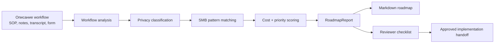
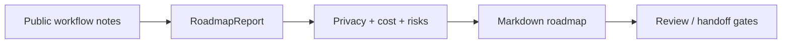
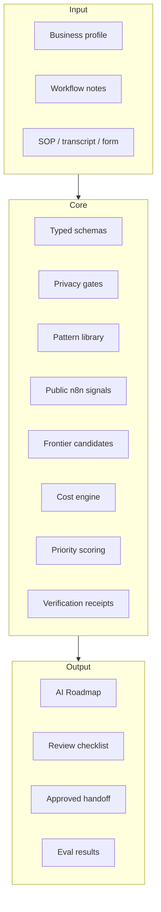

# AI Roadmap Studio

Локальный продукт для компаний, которые хотят понять, **нужно ли им внедрять AI,
где именно начинать, где AI опасен, сколько это может стоить и какой следующий
шаг безопасен**.

Это не агент, который сразу подключается к CRM и начинает что-то делать. Это
предварительный слой перед внедрением: он превращает описание рабочих процессов
в понятный AI implementation roadmap.

## Коротко

**Проблема:** у компаний много разговоров про AI, но мало ясности:

- какие процессы действительно стоит автоматизировать;
- где достаточно обычного скрипта или CRM-интеграции;
- где нужен LLM assistant;
- где нужен человек в контуре;
- где нельзя автоматизировать из-за рисков, данных или ответственности;
- сколько это примерно стоит;
- как проверить, что внедрение сработало.

**Решение:** AI Roadmap Studio берет описание workflow и выдает структурированный
roadmap:

- что автоматизировать;
- что пока не автоматизировать;
- какой тип решения подходит;
- какой privacy mode безопасен;
- диапазон стоимости и сроков;
- какие люди нужны;
- какие риски и human gates;
- как тестировать результат;
- что можно передать implementation-команде.

## Как это работает



## Что уже умеет текущая версия

Текущая версия уже умеет локально, без внешних credentials:

- читать demo business profile в Markdown;
- читать сохраненные public-source workflow fixtures;
- собирать typed `RoadmapReport`;
- классифицировать данные как `public`, `internal`, `confidential`,
  `sensitive`, `restricted`;
- блокировать небезопасные privacy-рекомендации;
- выбирать SMB implementation pattern;
- считать честные cost/time/team диапазоны, а не одну магическую цифру;
- определять приоритет инициативы;
- экспортировать roadmap в Markdown;
- запускаться через CLI;
- проверять roadmap через eval suite;
- делать reviewer checklist;
- экспортировать approved handoff только после approval и без blockers.

## Что продукт НЕ делает

Это важно для честного позиционирования.

Продукт сейчас не:

- подключается к production CRM;
- слушает реальные звонки;
- транскрибирует аудио;
- запускает production agents;
- отправляет сообщения клиентам;
- меняет данные в CRM;
- обещает ROI;
- обещает compliance certification;
- заменяет интервью с владельцами процессов.

Он помогает компании **понять, где AI имеет смысл, а где нет**, до того как она
потратит деньги на внедрение.

## Пример: салон красоты

Вход: описание процесса записи клиентов, подтверждений и reminders.

Выход:

- recommended initiative: appointment booking and reminder automation;
- do-not-automate: штрафы за отмену, медицинские/косметологические советы;
- privacy mode: cloud только после redaction контактных данных;
- solution type: deterministic calendar checks + optional LLM reply drafting;
- risks: double booking, wrong service duration, contact data exposure;
- validation: golden booking requests, calendar conflict checks;
- human gate: владелец подтверждает первый live workflow.

## Пример: юридический intake

Вход: описание процесса сбора документов для visa/legal checklist.

Выход:

- recommendation: private legal checklist assistant;
- do-not-automate: legal eligibility decisions, legal strategy, final advice;
- privacy mode: local/on-prem или strict private analysis;
- unrestricted cloud mode блокируется;
- human gate обязателен.

Это хороший пример, потому что продукт показывает не только “что можно сделать”,
но и **что нельзя делать**.

## Public-source примеры

Кроме synthetic SMB demos, в репозитории есть публичные workflow examples:

- HVAC lead intake;
- NetBox issue triage;
- GitLab incident workflow.

Они доказывают другой слой: продукт работает не только на выдуманных fixtures,
но и на сохраненных публичных описаниях реальных workflows. Это все еще не buyer
proof, но это сильный technical proof для demo.



## Public automation signals

Отдельный слой - public n8n template mining.

Мы не берем n8n templates как готовые решения и не копируем их в продукт. Мы
используем их как карту того, что люди уже пытаются автоматизировать.

Текущий mining run:

- `8,854` JSON files scanned;
- `8,824` n8n workflows parsed;
- `3,861` duplicate workflows collapsed;
- `4,963` deduplicated metadata candidates;
- `1,875` candidates with AI nodes;
- `2,069` candidates with risky action signals;
- `3,616` candidates with sensitivity signals.

Смотреть:

- `docs/experiments/n8n_template_mining_summary.md`;
- `docs/experiments/frontier_opportunity_discovery_opus46_summary.md`.

Claude Opus 4.6 используется как frontier candidate generator: он предлагает
missed opportunities, но deterministic verifier держит все candidates
non-exportable до human review.

## Клиентский отчет v2

После первых showcase reports стало понятно, что для серьезного клиента нужен
не короткий список рекомендаций, а сметно-архитектурный decision pack. Шесть
демо-отчетов в `docs/demo/` уже приведены к этому v2-формату.

Новый стандарт описан здесь:

- `docs/demo/CLIENT_REPORT_V2_UPGRADE_STRATEGY_RU.md`
- `docs/demo/CUSTOMER_REPORT_SHOWCASE_INDEX_RU.md`

Что добавляет v2:

- детальный roadmap по фазам implementation;
- role-hours по фазам и ролям;
- региональная смета для РФ и Европы, без US-first экономики;
- bill of materials: agents, APIs, DB, storage, queues, monitoring;
- LLM/API usage formula вместо оценки “на глаз”;
- proof layer через Entropy Core как отдельный paid add-on;
- AI Workflow Playbook как paid add-on для внутренней команды клиента;
- acceptance criteria, stop conditions, eval plan и human gates.

Смысл: продавать не “AI agent”, а первый уверенный шаг в AI adoption - что
строить, что не строить, почему, сколько это стоит и как доказать, что пилот
сработал.

## Архитектура простыми словами



## Доказательства рабочести

Текущий engineering proof:

- полный test suite: `364 passed`;
- ruff lint и format clean;
- 3 synthetic demo domains:
  - hair salon;
  - e-commerce returns/support;
  - legal consultancy;
- 3 public-source roadmap demos:
  - HVAC lead intake;
  - NetBox issue triage;
  - GitLab incident workflow;
- eval suite проверяет:
  - нет forbidden claims;
  - каждая рекомендация имеет evidence или assumptions;
  - legal restricted data блокирует unrestricted cloud;
  - single-point cost estimate rejected;
  - recommendation trace содержит pattern/cost/scoring/privacy versions;
- approved handoff нельзя экспортировать без approved review.
- public n8n mining дает `4,963` deduplicated metadata candidates;
- Opus 4.6 frontier run дал 3 useful candidates, но verifier оставил их
  `exportable_as_recommendation=false` до human review.

Команда для проверки:

```bash
.venv/bin/python -m pytest -q
```

Ожидаемый результат:

```text
364 passed
```

## Демо в терминале

Запуск красивого локального demo:

```bash
bash scripts/demo_roadmap_ru.sh
```

Скрипт:

- генерирует roadmap для demo hair salon workflow;
- генерирует roadmap для public-source HVAC workflow;
- показывает команду, которая запускается;
- печатает ключевые результаты;
- сохраняет Markdown roadmap в `.data/demo/exports/`.

## Как считаются стоимость, сроки и риски

Подробно: `docs/methodology/ROADMAP_CALCULATION_RU.md`.

Коротко:

- workflow берется из input file или public-source fixture;
- тип решения выбирается из versioned SMB pattern library;
- privacy mode решается deterministic policy gate;
- cost/time/team - planning range на основе pattern, scope, volume, privacy
  multiplier, assumptions и confidence;
- актуальные provider/integration prices перед quote должны обновляться через
  versioned price cards;
- LLM может помогать извлекать и формулировать drafts, но не утверждает privacy,
  cost, approval или handoff;
- hallucination risk снижается через schemas, evidence-or-assumption rule,
  source hashes, model metadata, evals и human review.

## Как это можно продавать

Не как “мы поставим вам AI agent”.

Лучше:

> Мы анализируем ваши рабочие процессы и превращаем их в практичный AI
> implementation roadmap: где AI реально нужен, где он не нужен, какие риски,
> какие данные, privacy mode, бюджетный диапазон, этапы внедрения и human review
> gates.

Потенциальный paid package:

- 3-5 workflow компании;
- короткий intake;
- локальный анализ;
- AI roadmap report;
- приоритизация инициатив;
- do-not-automate список;
- implementation handoff для первой инициативы.

## Кому это может быть нужно

Первичные ICP:

- owner/CEO малого или среднего бизнеса;
- COO / Head of Operations;
- Sales Ops / Support Lead;
- AI automation consultant;
- digital transformation consultant;
- технический founder, которому нужен pre-sales diagnostic.

## Что еще не доказано

Честная граница:

- техническая состоятельность MVP доказана локальными tests/evals;
- commercial demand еще нужно доказать разговорами и paid pilots;
- demo fixtures не являются buyer proof;
- реальные commercial claims должны опираться на пилот с настоящим workflow.

## Следующий правильный шаг

Для cofounder/sales проверки:

1. Показать terminal demo.
2. Показать generated Markdown roadmap.
3. Показать новый стандарт клиентского отчета v2:
   `docs/demo/CLIENT_REPORT_V2_UPGRADE_STRATEGY_RU.md`.
4. Показать showcase index из 6 customer-facing отчетов:
   `docs/demo/CUSTOMER_REPORT_SHOWCASE_INDEX_RU.md`.
5. Открыть polished accelerator пример:
   `docs/demo/ACCELERATOR_APPLICATION_REVIEW_ROADMAP_RU.md`.
6. Объяснить, что showcase reports уже приведены к v2 standard: каждый отчет
   показывает фазы, архитектуру, role-hours, RF/EU cost model, risk gates и proof
   layer.
7. Показать n8n mining summary и Opus 4.6 frontier summary.
8. Провести 10-20 discovery calls.
9. Проверить, готовы ли компании заплатить за AI readiness / AI roadmap package.
10. Получить 1 paid pilot на 3-5 workflows.
