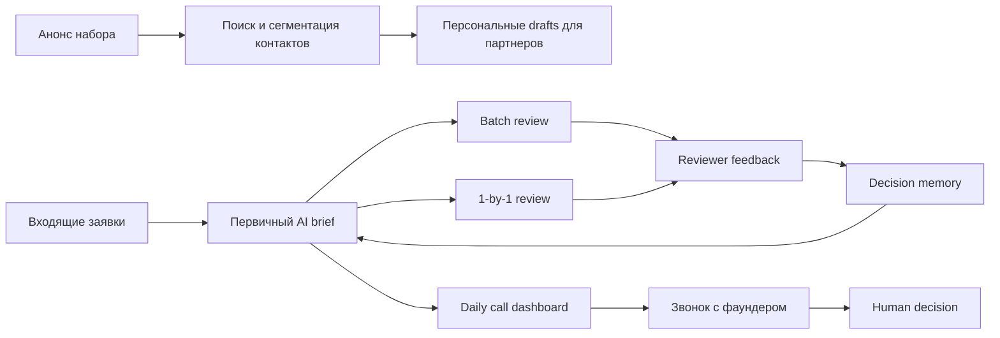
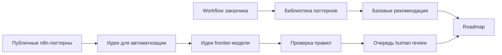

# Клиентский AI Roadmap отчет V2

## Клиентский пример: обработка заявок AI-native акселератора

Статус: flagship customer-facing demo report  
Тип: пакет решений по AI-внедрению  
Версия: report-v2  
Граница: демонстрационный отчет. Это не реальный клиентский пилот, не fixed
quote и не обещание ROI. Расчет ниже показывает, как должен выглядеть
обоснованный roadmap перед коммерческим предложением.

---

## 1. Краткое решение для заказчика

У акселератора есть поток заявок, партнерских контактов и звонков с фаундерами.
Команда тратит время не только на принятие решений, а на повторяемую подготовку:
прочитать заявку, проверить контекст, найти риски, подготовить вопросы, вспомнить
почему похожие заявки раньше принимали или отклоняли.

Рекомендация: строить не автономного “AI-отборщика”, а **human-in-the-loop
application review operating system**.

| Поле | Рекомендация |
|---|---|
| Первый use case | разбор заявок + ежедневные брифы к звонкам + базовая память ревьюеров |
| Не автоматизировать | final approve/reject, founder honesty judgment, outreach sending, investment decision |
| Scenario | Standard pilot; strict if applicant data and private notes require audit |
| Pilot-ready срок | 8-12 недель |
| Ожидаемый эффект | 8-15 часов/неделю меньше ручной подготовки при сохранении решения за человеком |
| Решение | начинать после согласования доступов, таксономии review и privacy mode |

Что заказчик получает после MVP:

- structured brief по каждой заявке;
- claims to verify;
- red flags с evidence labels;
- daily call briefs;
- reviewer decision memory;
- post-call feedback capture;
- без автоматического approve/reject.

---

## 2. Граница данных и доказательности

| Поле | Рабочее допущение |
|---|---|
| Workflow source | user-provided accelerator workflow example + product demo assumptions |
| Cohort volume | 500-1,500 applications/cohort |
| Calls | 20-40 founder calls/week during selection |
| Reviewers | 2-4 reviewers plus senior decision owner |
| Systems | email, Telegram, application form, CRM/Airtable/Notion, calendar, public web |
| Data class | founder contact/background/traction = sensitive/confidential depending on source |
| Чего не хватает перед сметой | real form schema, CRM access, sample applications, review rubric, consent policy |

Этот отчет может оценить pilot, но не фиксированную стоимость build, пока
заказчик не даст реальные volumes, sources, permissions и sample review
decisions.

---

## 3. Текущий процесс



| Шаг | Участник | Система | Боль | Подходит для автоматизации |
|---|---|---|---|---|
| Launch amplification | founder/operator | email/Telegram/CRM | contact search and drafts take time | medium HITL |
| Application intake | applicant/operator | form/CRM | inconsistent fields | high normalization |
| First pass brief | reviewer | CRM/docs/web | repeated reading and research | high assistant |
| Claim verification | reviewer/researcher | public sources/internal notes | facts vs claims unclear | medium research assistant |
| Batch review | reviewer team | dashboard/sheet | hard to compare consistently | medium HITL |
| 1-by-1 review | senior reviewer | dashboard | judgment-intensive | assistant only |
| Подготовка к звонку | partner/operator | calendar/CRM/web | повторная ручная подготовка | хорошо подходит для assistant |
| Финальное решение | partners | CRM | high-impact judgment | не автоматизировать |

---

## 4. Откуда взялись рекомендации

Roadmap не рождается из одного prompt. У каждой рекомендации есть происхождение:



| Слой | Что дает | Граница |
|---|---|---|
| Библиотека паттернов | triage, knowledge assistant, human-in-the-loop workflow, отчетность | не доказывает ROI |
| Опция n8n-паттернов | показывает, какие похожие связки люди уже автоматизируют: Slack, webhook, Sheets, Gmail, CRM, LLM | источник идей, не готовое решение |
| Claude Opus 4.6 | ищет missed opportunities и критикует базовый план | не утверждает roadmap |
| Проверка правил | privacy, human gates, do-not-automate checks | блокирует опасные идеи |
| Human review | финальное принятие или отклонение рекомендации | обязателен перед handoff |

**Отдельная опция для клиента: анализ публичных n8n-паттернов.**  
Мы не показываем клиенту количество найденных шаблонов и не копируем их как
решения. Мы используем их как практический reference: какие интеграции и
автоматизации уже часто собирают люди. Это помогает быстрее предложить варианты,
не начинать с пустого листа и лучше оценить, какие API/интеграции понадобятся.

---

## 5. Целевая архитектура

```text
Форма заявки / CRM / email / Telegram / calendar
  -> Реестр источников и прав доступа
  -> Нормализация заявок
  -> Privacy и redaction gate
  -> Разбор заявки
  -> Очередь проверки claims
  -> Память ревьюеров
  -> Генератор ежедневных call briefs
  -> Сбор post-call feedback
  -> Dashboard для human review
  -> Запись в CRM/Notion/Airtable только после approval
  -> Подтверждение доказательности и журнал аудита
```

| Компонент | Нужен | Комментарий |
|---|---|---|
| Source Register | mandatory | tracks allowed sources and evidence refs |
| Intake Normalizer | mandatory | maps form/CRM/email into application schema |
| Privacy Gate | mandatory | controls cloud/private/local path |
| Triage Worker | mandatory | creates structured briefs, not decisions |
| Research Queue | standard | checks claims only against approved source register |
| Reviewer Memory Store | standard | versioned rules, owner, source, rollback |
| Call Brief Generator | standard | calendar-driven daily briefs |
| Feedback Capture | standard/expansion | turns post-call notes into memory candidates |
| Human Review Dashboard | mandatory | approve/edit/reject briefs, memory rules, outreach drafts |
| Action Executor | restricted | CRM/status/message writes only after approval |
| DB | Postgres | applications, reviews, memory, decisions, logs |
| Object Storage | yes | source snapshots, evidence, exports |
| Vector Index | optional | only for approved docs/memory/source register |

---

## 6. Рекомендации

### R1. Помощник первичного разбора заявок

Structured brief for each application:

- founder and relevant background;
- product/customer/market summary;
- traction claims;
- claims to verify;
- red flags with evidence labels;
- “why worth a call”;
- “why likely not a fit”;
- next-step questions.

| Поле | Значение |
|---|---|
| Why first | closest to core pain and best feedback loop |
| Human gate | reviewer owns all decisions |
| Acceptance | 90% applications get uniform brief; unsupported claims marked |
| Not included | approve/reject, honesty judgment |

### R2. Ежедневный дашборд подготовки к звонкам

Daily page for today’s founder calls:

- application summary;
- founder background;
- market/product notes;
- contradictions/missing details;
- personalized questions;
- red flags to probe;
- relevant decision memory.

| Поле | Значение |
|---|---|
| Why | saves senior prep time before calls |
| Human gate | partner decides what to use |
| Acceptance | briefs ready before 09:00; every claim has source/assumption |
| Not included | automatic call decision |

### R3. Память ревьюеров и поддержка решений

Versioned memory for review logic.

Example entries:

- solo founder is usually negative, but acceptable under X/Y/Z;
- revenue claim without payment evidence is unverified;
- strong technical founder plus weak GTM may still be worth a call if market pull
  is clear.

| Поле | Значение |
|---|---|
| Why | creates compounding operational advantage |
| Human gate | new memory rule requires senior reviewer approval |
| Acceptance | every rule has owner/source/version and rollback |
| Not included | hidden scoring rule that auto-rejects applicants |

### R4. Помощник для amplification запуска

Find allowed contacts, deduplicate, segment, draft personal messages and prepare
approval queue.

| Поле | Значение |
|---|---|
| Why | launch amplification can save founder time |
| Human gate | every message approved before send |
| Acceptance | relationship context not invented; opt-out respected |
| Not included | automatic outreach sending |

---

## 7. Дополнительные идеи от frontier-модели

Claude Opus 4.6 получил контекст workflow и краткое описание найденных
automation-паттернов. Он предложил дополнительные идеи, но все они остались
неутвержденными до verifier и human review.

| ID | Идея | Почему полезно | Риск | Статус проверки |
|---|---|---|---|---|
| FOC-001 | помощник для проверки claims | проверяет traction/revenue claims по утвержденному source register | нельзя называть founder dishonest или автоматически отклонять | нужен human review |
| FOC-002 | сбор structured feedback после звонка | превращает инсайты после звонка в candidates для decision memory | может добавить friction для reviewers | нужен human review |
| FOC-003 | поиск повторных/похожих заявок | находит повторные заявки и похожие компании | fuzzy matching может давать false positives | нужен human review |

Отклоненные идеи:

- автономный скоринг заявок и auto-reject agent;
- “детектор честности founder”.

Рекомендация: FOC-002 можно добавить в standard pilot после R1/R2, FOC-001
оставить как контролируемое расширение, а FOC-003 включать только после проверки
реальной доли повторных заявок.

---

## 8. План внедрения по этапам

| Этап | Срок | Что делаем | Критерий завершения |
|---|---:|---|---|
| 0. Discovery | 1-2 недели | описать intake/review/calls/outreach, собрать 50-100 заявок, определить reviewer rubric | senior reviewer подтверждает границы |
| 1. Data readiness | 2 недели | schema заявки, source register, privacy mode, CRM/calendar access, red flag taxonomy | data и permission model утверждены |
| 2. Prototype | 2-3 недели | triage briefs и call briefs в shadow mode на historical/current applications | измерены usefulness и correction rate |
| 3. Pilot | 3-4 недели | review dashboard, feedback capture, basic decision memory, approved CRM writeback | нет auto decisions, измерен reviewer adoption |
| 4. Production-lite | 1-2 недели | monitoring, audit logs, runbook, rollback, prompt/model versioning | operator может вести cohort workflow |
| 5. Governance | ежемесячно | memory rule review, frontier candidate queue, eval refresh, cost review | decision log и proof receipts поддерживаются |

Рекомендуемый MVP scope:

- R1 помощник первичного разбора заявок;
- R2 ежедневный дашборд подготовки к звонкам;
- basic R3 Reviewer Memory;
- FOC-002 post-call feedback capture as optional standard add-on.

R4 outreach assistant лучше отложить, пока явно не согласованы consent, approval
queue и reputational rules.

---

## 9. Оценка ролей и часов

| Роль | Lean | Standard | Strict / proof layer |
|---|---:|---:|---:|
| AI solution architect | 20-40h | 50-90h | 100-170h |
| AI automation engineer | 120-240h | 280-560h | 560-1,000h |
| CRM/calendar integration engineer | 40-100h | 120-280h | 280-520h |
| Frontend/dashboard engineer | 40-100h | 120-260h | 260-480h |
| Research/eval engineer | 30-80h | 100-220h | 220-420h |
| Privacy/data reviewer | 16-50h | 60-140h | 140-300h |
| Senior reviewer/domain owner | 40-100h | 120-260h | 260-520h |
| PM/operator | 30-80h | 90-200h | 200-380h |

Lean means local/shadow workflow with limited integrations. Standard means pilot
dashboard and controlled writeback. Strict means proof receipts, audit bundles,
stronger data controls and repeatable delivery process.

---

## 10. Оценка стоимости: РФ и Европа

| Сценарий | Разовая сборка | Ежемесячные расходы | Для чего подходит |
|---|---:|---:|---|
| Lean RF | 1.8m-4.5m RUB | 120k-350k RUB | triage/call briefs in shadow mode |
| Standard RF | 5m-12m RUB | 350k-1.2m RUB | integrated cohort pilot |
| Strict RF + Proof Layer | 12m-28m+ RUB | 1.2m-3.5m+ RUB | sensitive review workflow with audit |
| Lean Europe | 30k-75k EUR | 1.2k-4k EUR | proof-of-value |
| Standard Europe | 85k-220k EUR | 4k-15k EUR | dashboard + integrations |
| Strict Europe + Proof Layer | 220k-520k+ EUR | 15k-45k+ EUR | governed AI review operating system |

Cost drivers:

- number of application sources and formats;
- CRM/Airtable/Notion/calendar integration complexity;
- volume of external research per application;
- whether raw applicant data can use cloud LLM;
- dashboard polish and collaboration features;
- evidence/proof/audit requirements;
- reviewer time required to train decision memory.

---

## 11. LLM, API и инфраструктура

| Компонент | Lean setup | Standard / strict setup |
|---|---|---|
| Hosting | local/private app VM | private cloud app + workers |
| DB | SQLite/Postgres | Postgres with backups |
| Object Storage | local folder | encrypted storage for evidence/source snapshots |
| Queue/Scheduler | simple cron | worker queue for research/call briefs |
| LLM | Sonnet-class for briefs, Opus-class for strategy/review | model pinned with change control |
| Search/Research | approved public source register | cached research with source receipts |
| CRM/Calendar | export/manual import | API sync and approved writeback |
| Dashboard | generated reports | review UI with corrections and memory approvals |

LLM cost formula:

```text
monthly_applications * avg_tokens_per_brief * model_price
+ monthly_calls * avg_tokens_per_call_brief * model_price
+ research/tool-call overhead
+ frontier review runs
```

Opus-class models should be reserved for architecture critique, complex
opportunity discovery and reviewer-facing synthesis. Routine classification,
normalization and reminders should use deterministic logic or cheaper model
tiers.

---

## 12. Риски и зоны, которые нельзя автоматизировать

| Риск | Контроль |
|---|---|
| auto-reject/auto-approve | blocked action; human decision required |
| founder “dishonesty” claim | prohibited framing; use evidence/assumption/needs verification labels |
| invented relationship context | source register and explicit unknown labels |
| private notes leaked | privacy gate and export policy |
| memory rule drifts silently | versioned rules, owner approval, rollback |
| bad outreach | approval queue, opt-out, sensitive contact exclusions |

Stop conditions:

- AI changes CRM decision status without approval;
- AI sends outreach or applicant message without approval;
- unsupported claim is shown as fact;
- private data appears in unauthorized export/log;
- reviewer trust falls below agreed threshold.

---

## 13. План проверки качества

Тестовый набор:

- 50-100 исторических заявок;
- 20 примеров принятых и отклоненных решений;
- 20 брифов к звонкам с feedback от reviewers;
- 20 примеров red flags и claims, которые нужно проверять;
- 10 outreach-примеров с разрешенными и заблокированными контактами.

Критерии приемки:

- 90% заявок получают полный structured brief;
- неподтвержденные claims помечаются как `needs verification`;
- reviewer принимает или редактирует больше 60% секций brief как полезные;
- call briefs готовы до ежедневного review;
- memory rules всегда показывают owner, source и version;
- количество автоматических решений или действий = 0.

Метрики пилота:

- сколько времени reviewer экономит на подготовке;
- как часто brief нужно исправлять;
- точность red flags по оценке reviewer;
- usefulness score для call briefs;
- adoption decision memory;
- количество заблокированных небезопасных действий.

---

## 14. Контроль и доказательность

В акселераторе решение субъективное и репутационно чувствительное. Поэтому
важно не только “сгенерировать brief”, но и показать, на каких источниках он
основан, какие assumptions остались и кто утвердил изменения в decision memory.

Что получает заказчик:

- список разрешенных источников;
- evidence labels для claims в заявке;
- список assumptions и пунктов “нужно проверить”;
- подтверждение, кто утвердил decision memory rule;
- список зон, которые AI не имеет права автоматизировать: approve/reject,
  honesty judgment, outreach sending, investment decision;
- журнал решений и изменений.

Слой доказательности на базе Entropy Core можно продавать как add-on для команд,
которым важно объяснять, почему рекомендация была допустима. AI Workflow
Playbook можно продавать как add-on для повторяемого внедрения: task graph,
eval gates, reviewer loop, operator handoff и monthly improvement cadence.

Позиционирование:

> Мы не продаем “AI выбирает стартапы”. Мы продаем управляемую систему review,
> которая экономит подготовительное время, делает процесс последовательнее и
> оставляет финальное решение людям.

---

## 15. Коммерческая упаковка

### Пакет A. AI Roadmap Sprint

- 1-2 недели;
- карта intake/review/call/outreach workflows;
- граница данных и источников;
- дизайн первого pilot;
- смета для РФ/Европы;
- список do-not-automate и рекомендация по proof layer.

### Пакет B. Пилот системы review

- 8-12 недель;
- помощник первичного разбора заявок;
- ежедневный dashboard к звонкам;
- базовая память ревьюеров;
- сбор feedback после звонков;
- контролируемая интеграция с CRM/calendar.

### Пакет C. Слой доказательности и playbook внедрения

- receipts на базе Entropy Core;
- evidence bundles;
- список blocked surfaces;
- implementation discipline на базе AI Workflow Playbook;
- monthly eval и governance loop.

---

## 16. Коммерческая рекомендация

Рекомендованный оффер: **диагностика review workflow + standard pilot системы
review + опциональный слой доказательности**.

Начинать, если:

- у акселератора достаточно заявок и звонков;
- есть senior reviewer, который владеет логикой решений;
- команда готова начать с shadow/human-in-the-loop режима;
- CRM/application source можно подключить или экспортировать.

Откладывать, если:

- заказчик хочет автономный approve/reject;
- нет владельца review taxonomy;
- нельзя согласовать источники данных и permission boundary;
- команда не готова давать feedback в decision memory.

Лучший первый scope внедрения:

1. Помощник первичного разбора заявок.
2. Ежедневный дашборд подготовки к звонкам.
3. Базовая память ревьюеров.
4. Сбор feedback после звонков.

Автоматизацию outreach лучше отложить, пока явно не согласованы consent,
reputation boundaries и approval workflow.

Главный вопрос для коммерческой проверки:

> Готов ли акселератор, VC platform team или admissions-heavy program платить за
> управляемую систему, которая экономит 8-15 часов в неделю и повышает
> последовательность review, не забирая финальное решение у людей?
