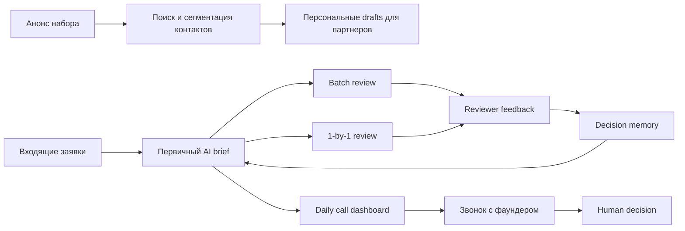
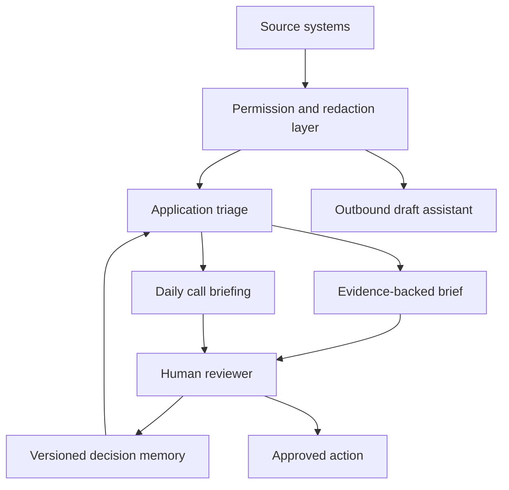
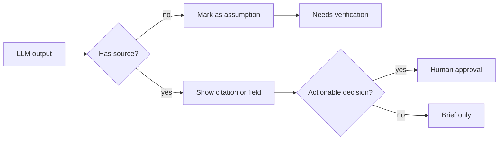

# AI Roadmap Report

## Клиентский пример: обработка заявок AI-native акселератора

Статус: демонстрационный customer-facing отчет  
Тип: AI implementation roadmap  
Версия: demo-v1  
Граница: пример показывает формат результата, который должен получать заказчик.
Это не реальный клиентский пилот, не коммерческая смета и не обещание ROI.

---

## 1. Коротко для заказчика

У акселератора есть поток заявок, партнерских контактов и звонков с фаундерами.
Команда тратит время не только на принятие решений, а на повторяемую подготовку:
прочитать заявку, проверить контекст, найти риски, подготовить вопросы, вспомнить
почему похожие заявки раньше принимали или отклоняли.

Рекомендация: строить не автономного "AI-отборщика", а **human-in-the-loop
application review operating system**.

Что получит команда после MVP:

- structured brief по каждой заявке до ручного ревью;
- список claims, которые нужно проверить;
- red flags с пометкой "доказано / предположение / требует проверки";
- ежедневные брифы к звонкам;
- живую decision memory, которая фиксирует логику прошлых решений;
- запрет на автоматический approve/reject без человека.

Ожидаемый эффект MVP: снять **8-15 часов ручной работы в неделю** при сохранении
человеческого контроля над решениями, репутационными действиями и коммуникацией.

---

## 2. Что мы сделали в продукте

AI Roadmap Studio уже умеет выдавать такой тип артефакта как roadmap, а не просто
"идею для AI-агента".

В текущей версии продукт умеет:

- читать описание workflow из Markdown/notes/source fixture;
- выделять actors, systems, inputs, handoffs и risky steps;
- выбирать подходящие AI-инициативы из pattern pack;
- определять privacy mode и do-not-automate границы;
- считать rough order-of-magnitude по времени, стоимости и ролям;
- собирать roadmap report с priority, risk, eval plan и implementation handoff;
- блокировать опасные claims через deterministic evals.

Этот документ показывает, как такой результат должен выглядеть для клиента на
более сложном use case: акселератор, заявки, CRM, звонки, research и review
memory.

---

## 3. Исходный workflow

| Шаг | Кто делает сейчас | Боль | Что можно улучшить |
|---|---|---|---|
| Анонс запуска | founder/operator | Долго искать контакты и писать персональные сообщения | Drafts и сегментация, но отправка только после approval |
| Первичный разбор заявок | reviewer/operator | Много чтения, качество первого прохода нестабильно | Structured brief по каждой заявке |
| Проверка claims | reviewer/researcher | Трудно быстро понять, где факт, а где непроверенное утверждение | Evidence labels и список проверок |
| Decision feedback | senior reviewer | Критерии остаются в голове команды | Versioned decision memory |
| Подготовка к звонкам | partner/operator | Каждый звонок требует повторного research | Daily call dashboard с вопросами и рисками |

Системы, которые обычно участвуют: email, Telegram, application form, CRM,
Airtable/Notion, calendar, public web sources, internal review notes.

---

## 4. Рекомендованная архитектура

Главный принцип: AI готовит решения, но не принимает решения.

Модель может помогать в:

- summarization;
- research synthesis;
- contradiction spotting;
- question generation;
- draft writing;
- feedback compression into memory rules.

Модель не должна:

- принимать финальное решение;
- отправлять сообщения без approval;
- утверждать, что человек "лжет";
- скрывать источники и assumptions;
- менять criteria без reviewer approval.

---

## 5. Рекомендации

### R1. Application Triage Assistant

**Что построить:** assistant, который читает входящую заявку и готовит
structured brief:

- кто founder и какой у него релевантный опыт;
- что за продукт и кому он нужен;
- какие traction claims заявлены;
- что надо проверить;
- какие есть red flags;
- почему стоит поговорить;
- почему это может быть мимо;
- какие вопросы задать на следующем шаге.

**Почему это первая инициатива:** она ближе всего к основной боли и дает быстрый
feedback loop. Каждый review превращается в данные для улучшения системы.

| Параметр | Оценка |
|---|---:|
| Срок MVP | 3-6 недель |
| One-time implementation | 6,000-22,000 USD |
| Monthly run cost | 300-2,000 USD |
| Нужные роли | AI automation engineer, reviewer, ops owner, privacy reviewer |
| Confidence | Medium |

Human gate: reviewer принимает все решения сам. AI не выдает approve/reject.

Acceptance criteria:

- 90% заявок получают brief в едином формате;
- каждый red flag имеет evidence label;
- unsupported claims помечены как "needs verification";
- reviewer может исправить brief и сохранить feedback;
- нет автоматических отказов или approval.

---

### R2. Daily Call Briefing Dashboard

**Что построить:** ежедневную страницу по всем звонкам на сегодня.

Каждый call brief содержит:

- summary заявки;
- founder background;
- market/product notes;
- claims to verify;
- contradictions or missing details;
- personalized questions;
- red flags to probe;
- "что может изменить наше мнение";
- relevant decision memory entries.

**Почему это ценно:** подготовка к звонку дорогая, но хорошо структурируется.
Команда тратит время на разговор, а не на повторный сбор контекста.

| Параметр | Оценка |
|---|---:|
| Срок MVP | 2-5 недель |
| One-time implementation | 4,000-15,000 USD |
| Monthly run cost | 200-1,500 USD |
| Нужные роли | AI automation engineer, researcher/analyst, calendar/CRM owner |
| Confidence | Medium |

Human gate: partner/operator читает brief до звонка и сам решает, что
использовать.

Acceptance criteria:

- briefs готовы до 09:00 каждый день;
- каждый brief показывает источники или assumptions;
- вопросы не повторяют очевидный form content;
- private notes не уходят во внешние каналы без permission.

---

### R3. Reviewer Memory And Decision Support

**Что построить:** versioned memory по логике review.

Примеры memory entries:

- "Solo founder обычно negative signal, но допустим при X/Y/Z."
- "Revenue claim без payment evidence должен считаться unverified."
- "Strong technical founder + weak GTM может быть worth a call, если есть clear
  market pull."

**Почему это важно:** без памяти система будет каждый раз начинать заново.
Memory превращает опыт reviewer team в reusable operating asset.

| Параметр | Оценка |
|---|---:|
| Срок MVP | 3-6 недель |
| One-time implementation | 5,000-18,000 USD |
| Monthly run cost | 100-800 USD |
| Нужные роли | AI engineer, senior reviewer, ops owner |
| Confidence | Medium-low |

Human gate: новая memory rule начинает влиять на future briefs только после
approval reviewer.

Acceptance criteria:

- каждая rule имеет owner, source и version;
- reviewer видит, какая rule повлияла на brief;
- disagreement между reviewers не скрывается;
- можно отключить или откатить rule.

---

### R4. Outbound Launch Amplification Assistant

**Что построить:** assistant, который помогает подготовить запуск набора:

- найти релевантные контакты в разрешенных источниках;
- дедуплицировать людей;
- сегментировать: close, warm, distant, cold;
- написать персональные drafts;
- подготовить approval queue.

**Почему не ставим первым:** ценность высокая, но reputation risk выше. Нельзя
автоматически писать людям без согласия и человеческого контроля.

| Параметр | Оценка |
|---|---:|
| Срок MVP | 1-3 недели |
| One-time implementation | 2,000-8,000 USD |
| Monthly run cost | 50-500 USD |
| Нужные роли | AI automation engineer, founder/operator, sales/marketing owner |
| Confidence | Medium |

Human gate: founder/operator approve every message before sending.

Acceptance criteria:

- message drafts не отправляются автоматически;
- relationship context не выдумывается;
- opt-out и sensitive contacts исключаются;
- сегменты можно исправлять вручную.

---

## 6. Приоритет

| Priority | Initiative | Почему сейчас | Риск | Решение |
|---:|---|---|---|---|
| 1 | Application triage | Самая частая боль и лучший feedback loop | Medium-high | Build first |
| 2 | Daily call briefing | Быстро экономит senior-время | Medium | Build with triage |
| 3 | Reviewer memory | Дает compounding value | Medium | Start after feedback appears |
| 4 | Outbound assistant | Полезно перед launch | Medium-high | Build only with clear approval rules |

Рекомендуемый MVP scope: **R1 + R2 + базовая R3**.

R4 добавлять после того, как команда явно согласует consent, approval queue и
границы outreach.

---

## 7. Расчет времени, стоимости и ресурсов

### Допущения

Расчет ниже не является quote. Это planning range, который строится из:

- количества workflow modules;
- сложности integrations;
- глубины research;
- sensitivity данных;
- объема human review;
- требований к audit trail;
- maturity существующего CRM/application process.

Базовый сценарий для оценки:

- 1,000 заявок за cohort;
- 20-40 founder calls в неделю;
- 2-4 reviewers;
- application database уже существует;
- outbound contacts доступны только после explicit permission;
- production actions требуют human approval.

### MVP package

| Scope | Estimate |
|---|---:|
| R1 Application triage | 3-6 недель / 6,000-22,000 USD |
| R2 Daily call briefing | 2-5 недель / 4,000-15,000 USD |
| R3 Basic reviewer memory | 3-6 недель / 5,000-18,000 USD |
| Integrated MVP | 6-10 недель / 18,000-55,000 USD |
| Monthly LLM/API/hosting | 700-4,000 USD |
| Maintenance | 1-3 дня в месяц |

Минимальная команда:

- AI automation engineer;
- accelerator operator as product owner;
- senior reviewer as decision owner;
- part-time privacy/data reviewer.

Опционально:

- researcher/analyst;
- CRM/integration specialist;
- frontend/dashboard engineer.

Главные cost drivers:

- clean access к CRM/calendar/application data;
- разрешено ли использовать cloud LLM;
- сколько external research нужен на одну заявку;
- нужно ли хранить audit trail по каждой recommendation;
- насколько polished должен быть dashboard.

---

## 8. Источник истины и роль LLM

Source of truth:

- application form/database;
- CRM status;
- reviewer decisions;
- approved decision memory;
- calendar events;
- manually approved source register;
- pricing/rate cards для implementation estimates.

LLM помогает:

- суммаризировать;
- найти противоречия;
- подготовить вопросы;
- сделать draft;
- сгруппировать feedback;
- объяснить recommendation простым языком.

LLM не является source of truth для:

- final admission decision;
- факта "человек солгал";
- privacy policy;
- стоимости без estimate model;
- CRM status;
- consent и permission.

---

## 9. Защита от галлюцинаций

Safeguards:

- каждый claim получает label: evidence-backed, inferred, needs verification;
- red flags не формулируются как факт без источника;
- approve/reject отсутствует в AI output;
- reviewer corrections сохраняются как feedback;
- memory rules проходят approval;
- private data не попадает в exports без policy;
- eval suite проверяет forbidden claims и missing evidence.

Stop conditions:

- AI отправил message без approval;
- AI отклонил или принял кандидата;
- unsupported claim показан как факт;
- private data появилась в логах или export без permission;
- reviewer trust падает ниже agreed threshold.

---

## 10. 30/60/90 Day Plan

### Days 0-30

- Описать workflow: intake, review, calls, decision, outreach.
- Собрать 30-50 historical applications.
- Согласовать red flag taxonomy.
- Согласовать privacy mode и data retention.
- Построить first triage brief template.
- Запустить shadow mode: AI briefs создаются, но решения идут по старому
  процессу.

### Days 31-60

- Подключить daily call briefing.
- Добавить reviewer feedback capture.
- Начать versioned decision memory.
- Измерять correction rate, usefulness rating и time saved.
- Включить privacy/logging controls.

### Days 61-90

- Расширить research depth только для заявок, которые дошли до звонка.
- Добавить reviewer disagreement tracking.
- Подготовить implementation handoff для stable modules.
- Решить: scale, revise или stop.
- Добавить outbound launch assistant, если approval и consent boundaries готовы.

---

## 11. Что заказчик получает на выходе

Deliverables после AI Roadmap Sprint:

- workflow map;
- opportunity map;
- ranked initiatives;
- do-not-automate list;
- privacy mode recommendation;
- cost/time/team estimate;
- 30/60/90 day roadmap;
- eval plan;
- first implementation handoff;
- list of data needed for pilot.

То есть заказчик получает не "AI demo", а понятный decision artifact: что
делать, что не делать, почему, сколько это примерно займет, кто нужен и как
понять, что оно работает.

---

## 12. Итоговая рекомендация

Proceed with MVP, but keep positioning precise:

> Build a human-in-the-loop application review operating system, not an
> autonomous accelerator agent.

Почему это сильный use case:

- процесс повторяемый и high-volume;
- человеческий judgment остается ценным;
- AI может экономить время до того, как будет доверено действие;
- review memory создает накопительный operational advantage;
- качество можно быстро проверить через reviewer usefulness и time saved.

Главный вопрос для commercial validation:

> Готова ли команда акселератора или investment team платить за систему, которая
> экономит 8-15 часов в неделю и делает review более последовательным, не забирая
> финальное решение у человека?
