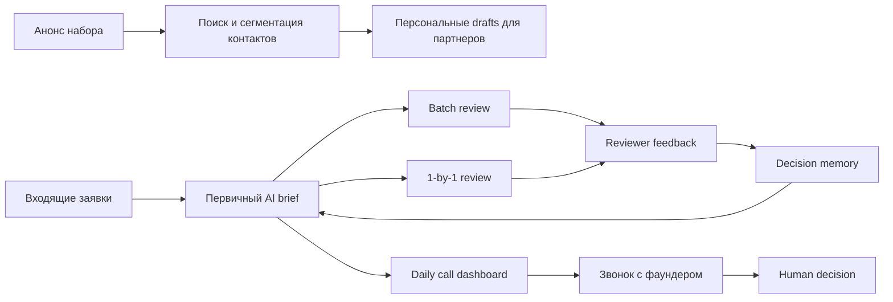
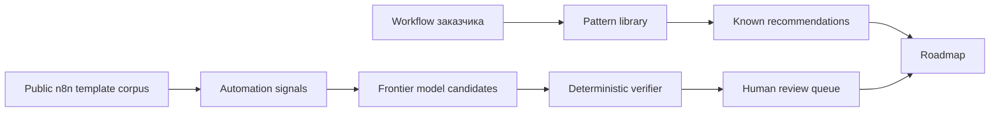

# AI Roadmap Report V2

## Клиентский пример: обработка заявок AI-native акселератора

Статус: flagship customer-facing demo report  
Тип: AI Implementation Decision Pack  
Версия: report-v2  
Граница: демонстрационный отчет. Это не реальный клиентский пилот, не fixed
quote и не обещание ROI. Расчет ниже показывает, как должен выглядеть
обоснованный roadmap перед коммерческим предложением.

---

## 1. Executive Decision Summary

У акселератора есть поток заявок, партнерских контактов и звонков с фаундерами.
Команда тратит время не только на принятие решений, а на повторяемую подготовку:
прочитать заявку, проверить контекст, найти риски, подготовить вопросы, вспомнить
почему похожие заявки раньше принимали или отклоняли.

Рекомендация: строить не автономного “AI-отборщика”, а **human-in-the-loop
application review operating system**.

| Decision Field | Recommendation |
|---|---|
| First use case | application triage + daily call briefing + basic reviewer memory |
| Не автоматизировать | final approve/reject, founder honesty judgment, outreach sending, investment decision |
| Scenario | Standard pilot; strict if applicant data and private notes require audit |
| Pilot-ready срок | 8-12 недель |
| Expected effect | 8-15 часов/неделю меньше ручной подготовки при сохранении human decision |
| Proceed decision | proceed after source access, reviewer taxonomy and privacy mode are approved |

What the buyer gets after MVP:

- structured brief по каждой заявке;
- claims to verify;
- red flags with evidence labels;
- daily call briefs;
- reviewer decision memory;
- post-call feedback capture;
- no automatic approve/reject.

---

## 2. Evidence Boundary

| Evidence Field | Planning Assumption |
|---|---|
| Workflow source | user-provided accelerator workflow example + product demo assumptions |
| Cohort volume | 500-1,500 applications/cohort |
| Calls | 20-40 founder calls/week during selection |
| Reviewers | 2-4 reviewers plus senior decision owner |
| Systems | email, Telegram, application form, CRM/Airtable/Notion, calendar, public web |
| Data class | founder contact/background/traction = sensitive/confidential depending on source |
| Missing evidence before quote | real form schema, CRM access, sample applications, review rubric, consent policy |

This report can estimate a pilot, but not a fixed build price, until the buyer
provides real volumes, sources, permissions and sample review decisions.

---

## 3. Current-State Workflow



| Step | Actor | System | Pain | Automation Fit |
|---|---|---|---|---|
| Launch amplification | founder/operator | email/Telegram/CRM | contact search and drafts take time | medium HITL |
| Application intake | applicant/operator | form/CRM | inconsistent fields | high normalization |
| First pass brief | reviewer | CRM/docs/web | repeated reading and research | high assistant |
| Claim verification | reviewer/researcher | public sources/internal notes | facts vs claims unclear | medium research assistant |
| Batch review | reviewer team | dashboard/sheet | hard to compare consistently | medium HITL |
| 1-by-1 review | senior reviewer | dashboard | judgment-intensive | assistant only |
| Call prep | partner/operator | calendar/CRM/web | repeated prep work | high assistant |
| Final decision | partners | CRM | high-impact judgment | do not automate |

---

## 4. Opportunity Provenance

Roadmap is not produced by one prompt. Recommendation provenance:



| Layer | What It Adds | Boundary |
|---|---|---|
| Pattern library | triage, knowledge assistant, HITL workflow, reporting automation | not ROI proof |
| Public n8n mining | common automation signals: Slack/webhook/Sheets/Gmail/OpenAI/CRM flows | idea corpus only |
| Claude Opus 4.6 | missed opportunities and critique | cannot approve roadmap |
| Deterministic verifier | privacy, human gates, do-not-automate checks | blocks unsafe candidates |
| Human review | final accept/reject of recommendation | required before handoff |

Public n8n corpus after dedupe:

| Metric | Value |
|---|---:|
| Scanned JSON files | 8,854 |
| Parsed n8n workflows | 8,824 |
| Duplicate workflows collapsed | 3,861 |
| Deduplicated candidates | 4,963 |
| Candidates with AI nodes | 1,875 |
| Candidates with risky action signals | 2,069 |
| Candidates with sensitivity signals | 3,616 |

These templates are not copied as solutions. They are used as public automation
signals before verifier and human review.

---

## 5. Target Architecture

```text
Application form / CRM / email / Telegram / calendar
  -> Source Register and Permission Layer
  -> Intake Normalizer
  -> Privacy and Redaction Gate
  -> Application Triage Worker
  -> Claim Verification Research Queue
  -> Reviewer Memory Store
  -> Daily Call Brief Generator
  -> Post-Call Feedback Capture
  -> Human Review Dashboard
  -> Approved CRM/Notion/Airtable Writeback
  -> Evidence Receipt and Audit Log
```

| Component | Needed | Notes |
|---|---|---|
| Source Register | mandatory | tracks allowed sources and evidence refs |
| Intake Normalizer | mandatory | maps form/CRM/email into application schema |
| Privacy Gate | mandatory | controls cloud/private/local path |
| Triage Worker | mandatory | creates structured briefs, not decisions |
| Research Queue | standard | checks claims only against approved source register |
| Reviewer Memory Store | standard | versioned rules, owner, source, rollback |
| Call Brief Generator | standard | calendar-driven daily briefs |
| Feedback Capture | standard/expansion | turns post-call notes into memory candidates |
| Human Review Dashboard | mandatory | approve/edit/reject briefs, memory rules, outreach drafts |
| Action Executor | restricted | CRM/status/message writes only after approval |
| DB | Postgres | applications, reviews, memory, decisions, logs |
| Object Storage | yes | source snapshots, evidence, exports |
| Vector Index | optional | only for approved docs/memory/source register |

---

## 6. Recommendation Cards

### R1. Application Triage Assistant

Structured brief for each application:

- founder and relevant background;
- product/customer/market summary;
- traction claims;
- claims to verify;
- red flags with evidence labels;
- “why worth a call”;
- “why likely not a fit”;
- next-step questions.

| Field | Value |
|---|---|
| Why first | closest to core pain and best feedback loop |
| Human gate | reviewer owns all decisions |
| Acceptance | 90% applications get uniform brief; unsupported claims marked |
| Not included | approve/reject, honesty judgment |

### R2. Daily Call Briefing Dashboard

Daily page for today’s founder calls:

- application summary;
- founder background;
- market/product notes;
- contradictions/missing details;
- personalized questions;
- red flags to probe;
- relevant decision memory.

| Field | Value |
|---|---|
| Why | saves senior prep time before calls |
| Human gate | partner decides what to use |
| Acceptance | briefs ready before 09:00; every claim has source/assumption |
| Not included | automatic call decision |

### R3. Reviewer Memory and Decision Support

Versioned memory for review logic.

Example entries:

- solo founder is usually negative, but acceptable under X/Y/Z;
- revenue claim without payment evidence is unverified;
- strong technical founder plus weak GTM may still be worth a call if market pull
  is clear.

| Field | Value |
|---|---|
| Why | creates compounding operational advantage |
| Human gate | new memory rule requires senior reviewer approval |
| Acceptance | every rule has owner/source/version and rollback |
| Not included | hidden scoring rule that auto-rejects applicants |

### R4. Outbound Launch Amplification Assistant

Find allowed contacts, deduplicate, segment, draft personal messages and prepare
approval queue.

| Field | Value |
|---|---|
| Why | launch amplification can save founder time |
| Human gate | every message approved before send |
| Acceptance | relationship context not invented; opt-out respected |
| Not included | automatic outreach sending |

---

## 7. Frontier Candidates

Claude Opus 4.6 received workflow context and n8n mining summary. It proposed
additional candidates. All remained non-exportable until human review.

| ID | Candidate | Why Useful | Risk | Verifier Status |
|---|---|---|---|---|
| FOC-001 | Claim verification research assistant | checks traction/revenue claims against approved source register | cannot call founder dishonest or reject automatically | needs human review |
| FOC-002 | Post-call structured feedback capture | turns call insights into decision memory candidates | can add reviewer friction | needs human review |
| FOC-003 | Duplicate/repeat applicant detection | finds repeated applications and similar companies | fuzzy false positives | needs human review |

Rejected ideas:

- autonomous application scoring and auto-reject agent;
- AI-driven founder honesty detector.

Recommendation: include FOC-002 in standard pilot after R1/R2, keep FOC-001 as
controlled expansion, and validate duplicate rate before FOC-003.

---

## 8. Phase-by-Phase Roadmap

| Phase | Duration | Work | Exit Criteria |
|---|---:|---|---|
| 0. Discovery | 1-2 weeks | map intake/review/calls/outreach, collect 50-100 applications, define reviewer rubric | senior reviewer confirms boundaries |
| 1. Data readiness | 2 weeks | application schema, source register, privacy mode, CRM/calendar access, red flag taxonomy | data and permission model approved |
| 2. Prototype | 2-3 weeks | triage briefs and call briefs in shadow mode on historical/current applications | usefulness and correction rate measured |
| 3. Pilot | 3-4 weeks | review dashboard, feedback capture, basic decision memory, approved CRM writeback | no auto decisions; reviewer adoption measured |
| 4. Production-lite | 1-2 weeks | monitoring, audit logs, runbook, rollback, prompt/model versioning | operator can run cohort workflow |
| 5. Governance | monthly | memory rule review, frontier candidate queue, eval refresh, cost review | decision log and proof receipts maintained |

Recommended MVP scope:

- R1 Application Triage Assistant;
- R2 Daily Call Briefing Dashboard;
- basic R3 Reviewer Memory;
- FOC-002 post-call feedback capture as optional standard add-on.

R4 outreach assistant should wait until consent, approval queue and reputational
rules are explicit.

---

## 9. Role-Hour Estimate

| Role | Lean | Standard | Strict/Proof Layer |
|---|---:|---:|---:|
| AI solution architect | 20-40h | 50-90h | 100-170h |
| AI automation engineer | 120-240h | 280-560h | 560-1,000h |
| CRM/calendar integration engineer | 40-100h | 120-280h | 280-520h |
| Frontend/dashboard engineer | 40-100h | 120-260h | 260-480h |
| Research/eval engineer | 30-80h | 100-220h | 220-420h |
| Privacy/data reviewer | 16-50h | 60-140h | 140-300h |
| Senior reviewer/domain owner | 40-100h | 120-260h | 260-520h |
| PM/operator | 30-80h | 90-200h | 200-380h |

Lean means local/shadow workflow with limited integrations. Standard means pilot
dashboard and controlled writeback. Strict means proof receipts, audit bundles,
stronger data controls and repeatable delivery process.

---

## 10. Cost Estimate: RF and Europe

| Scenario | One-Time Build | Monthly Run | Best For |
|---|---:|---:|---|
| Lean RF | 1.8m-4.5m RUB | 120k-350k RUB | triage/call briefs in shadow mode |
| Standard RF | 5m-12m RUB | 350k-1.2m RUB | integrated cohort pilot |
| Strict RF + Proof Layer | 12m-28m+ RUB | 1.2m-3.5m+ RUB | sensitive review workflow with audit |
| Lean Europe | 30k-75k EUR | 1.2k-4k EUR | proof-of-value |
| Standard Europe | 85k-220k EUR | 4k-15k EUR | dashboard + integrations |
| Strict Europe + Proof Layer | 220k-520k+ EUR | 15k-45k+ EUR | governed AI review operating system |

Cost drivers:

- number of application sources and formats;
- CRM/Airtable/Notion/calendar integration complexity;
- volume of external research per application;
- whether raw applicant data can use cloud LLM;
- dashboard polish and collaboration features;
- evidence/proof/audit requirements;
- reviewer time required to train decision memory.

---

## 11. LLM/API/Infrastructure

| Component | Lean Setup | Standard/Strict Setup |
|---|---|---|
| Hosting | local/private app VM | private cloud app + workers |
| DB | SQLite/Postgres | Postgres with backups |
| Object Storage | local folder | encrypted storage for evidence/source snapshots |
| Queue/Scheduler | simple cron | worker queue for research/call briefs |
| LLM | Sonnet-class for briefs, Opus-class for strategy/review | model pinned with change control |
| Search/Research | approved public source register | cached research with source receipts |
| CRM/Calendar | export/manual import | API sync and approved writeback |
| Dashboard | generated reports | review UI with corrections and memory approvals |

LLM cost formula:

```text
monthly_applications * avg_tokens_per_brief * model_price
+ monthly_calls * avg_tokens_per_call_brief * model_price
+ research/tool-call overhead
+ frontier review runs
```

Opus-class models should be reserved for architecture critique, complex
opportunity discovery and reviewer-facing synthesis. Routine classification,
normalization and reminders should use deterministic logic or cheaper model
tiers.

---

## 12. Risk and Do-Not-Automate Register

| Risk | Control |
|---|---|
| auto-reject/auto-approve | blocked action; human decision required |
| founder “dishonesty” claim | prohibited framing; use evidence/assumption/needs verification labels |
| invented relationship context | source register and explicit unknown labels |
| private notes leaked | privacy gate and export policy |
| memory rule drifts silently | versioned rules, owner approval, rollback |
| bad outreach | approval queue, opt-out, sensitive contact exclusions |

Stop conditions:

- AI changes CRM decision status without approval;
- AI sends outreach or applicant message without approval;
- unsupported claim is shown as fact;
- private data appears in unauthorized export/log;
- reviewer trust falls below agreed threshold.

---

## 13. Evaluation Plan

Golden set:

- 50-100 historical applications;
- 20 accepted/rejected decision examples;
- 20 call briefs with reviewer feedback;
- 20 red flag/claim verification examples;
- 10 outreach examples with allowed/blocked contacts.

Acceptance:

- 90% applications receive complete structured brief;
- unsupported claims are labeled `needs verification`;
- reviewer accepts or edits more than 60% of brief sections as useful;
- call briefs are ready before daily review time;
- memory rules always show owner/source/version;
- auto decision/action count = 0.

Pilot metrics:

- reviewer prep time saved;
- brief correction rate;
- red flag precision/recall by reviewer judgment;
- call brief usefulness score;
- decision memory adoption;
- number of blocked unsafe actions.

---

## 14. Governance and Proof Layer

Entropy Core Proof Layer is a strong add-on for accelerator/investment workflows
because decisions are reputational, subjective and evidence-sensitive.

Proof artifacts:

- source register with allowed sources;
- application/source hashes;
- claim evidence labels;
- assumption registry;
- reviewer approval receipts;
- blocked-surface list;
- memory rule version receipts;
- frontier candidate verifier status;
- decision log and audit bundle.

AI Workflow Playbook is also a strong add-on:

- implementation contract;
- task graph for each workflow module;
- eval gates before model/prompt changes;
- reviewer loop;
- operator handoff;
- monthly improvement cadence.

Positioning:

> We are not selling “AI will choose startups”. We are selling a governed review
> operating system that saves preparation time, improves consistency and keeps
> final judgment with humans.

---

## 15. Commercial Packaging

### Package A. AI Roadmap Sprint

- 1-2 weeks;
- map intake/review/call/outreach workflows;
- source/evidence boundary;
- first pilot design;
- RF/EU implementation estimate;
- do-not-automate and proof layer recommendation.

### Package B. Standard Accelerator Review Pilot

- 8-12 weeks;
- application triage assistant;
- daily call dashboard;
- basic reviewer memory;
- post-call feedback capture;
- controlled CRM/calendar integration.

### Package C. Proof Layer and Playbook Add-On

- Entropy Core receipts;
- evidence bundles;
- blocked-surface registry;
- AI Workflow Playbook implementation discipline;
- monthly eval and governance loop.

---

## 16. Final Recommendation

Proceed with standard pilot if the accelerator has enough application/call
volume and one senior reviewer is willing to own the decision taxonomy.

Best first implementation:

1. Application Triage Assistant.
2. Daily Call Briefing Dashboard.
3. Basic Reviewer Memory.
4. Post-call Feedback Capture.

Delay outreach automation until consent, reputation boundaries and approval
workflow are explicit.

Main commercial validation question:

> Will an accelerator, VC platform team or admissions-heavy program pay for a
> governed system that saves 8-15 hours/week and improves review consistency
> without taking final decisions away from humans?
