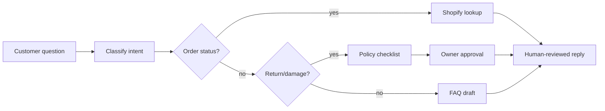

# Клиентский AI Roadmap отчет V2

## Клиентский пример: e-commerce support, order status и returns

Статус: демонстрационный customer-facing отчет  
Тип: пакет решений по AI-внедрению  
Граница: synthetic demo; не доказательство спроса, не фиксированная смета и не
обещание ROI.

---

## 1. Краткое решение для заказчика

Shopify-магазин получает повторяющиеся вопросы: order status, returns, damaged
items, product details. Support assistant вручную ищет заказ, копирует ответы из
Google Doc, а refund требует owner approval.

Рекомендация: строить **support triage + deterministic order lookup + human
refund gate**, а не autonomous refund bot.

| Поле | Рекомендация |
|---|---|
| Первый use case | order status lookup + support triage в shadow mode |
| Не автоматизировать | refunds, compensation, final damaged-item resolution |
| Scenario | Standard pilot if Shopify/helpdesk API доступен |
| Pilot-ready срок | 6-8 недель |
| Ожидаемый эффект | меньше owner interruptions, быстрее first response, стабильнее returns policy |
| Решение | начинать после проверки ticket volume и refund policy |

---

## 2. Граница данных и доказательности

| Поле | Рабочее допущение |
|---|---|
| Workflow source | synthetic Shopify/Gmail/Instagram support workflow |
| Monthly volume | 800-2,000 support messages/month |
| Systems | Shopify, Gmail/helpdesk, Instagram, Google Docs FAQ |
| Data class | customer identity/address/order data = sensitive |
| Current pain | repetitive status checks, inconsistent return answers, owner bottleneck |
| Missing evidence before quote | ticket sample, refund policy, SKU taxonomy, order lookup permissions |

Before a real quote, buyer must provide historical ticket labels, refund cases,
FAQ/SOP and Shopify API constraints.

---

## 3. Текущий процесс



| Шаг | Участник | Система | Боль | Подходит для автоматизации |
|---|---|---|---|---|
| Intent classification | support assistant | helpdesk/Gmail | repetitive labels | high |
| Order lookup | support assistant | Shopify | factual lookup repeated all day | high deterministic |
| FAQ answer | support assistant | Google Docs | inconsistent copy/paste | medium AI draft |
| Return checklist | support + owner | policy doc/Shopify | policy drift | high HITL |
| Refund approval | owner | Shopify/payment | financial decision | do not automate |
| Weekly reporting | owner | Sheets/helpdesk | no visibility | high deterministic |

---

## 4. Откуда взялись рекомендации

| Слой | Что дает | Граница |
|---|---|---|
| Pattern library | customer support triage, e-commerce returns, reporting automation | known pattern |
| Опция n8n-паттернов | идеи по связкам Gmail/helpdesk, Shopify-like API, Sheets reporting, LLM drafts | источник идей, не готовое решение |
| Frontier candidates | damaged-item evidence checklist, owner interruption dashboard | review queue |
| Verifier | blocks automatic refunds and unsupported policy claims | deterministic gate |

**Отдельная опция для клиента: анализ публичных n8n-паттернов.**  
Для e-commerce это помогает быстро увидеть типовые связки, которые уже часто
автоматизируют: support inbox, order lookup, таблицы отчетности, LLM drafts и
approval queue. Это не доказывает ROI, но помогает выбрать реалистичную
архитектуру пилота.

---

## 5. Целевая архитектура

```text
Helpdesk/Gmail/Instagram intake
  -> Нормализация тикетов
  -> Проверка личности и заказа
  -> Классификация intent
  -> Поиск заказа в Shopify
  -> Поиск FAQ/policy
  -> Черновик ответа от LLM
  -> Checklist для returns
  -> Очередь approval для владельца
  -> Запись ответа/tag/task после approval
  -> Журнал действий и еженедельный отчет
```

| Компонент | Нужен | Комментарий |
|---|---|---|
| Ticket Normalizer | yes | maps channel messages into one schema |
| Shopify Connector | yes | read orders; refund write disabled in MVP |
| FAQ/Policy Store | yes | source of truth for answers |
| AI Draft Worker | yes | drafts answers with citations to policy |
| Returns Checklist | yes | deterministic policy checklist |
| Owner Approval Queue | yes | refunds and exceptions |
| DB | Postgres recommended | tickets, decisions, approvals, audit |
| Monitoring | yes | wrong lookup, stale policy, approval backlog |

---

## 6. Рекомендации

### R1. Детерминированный поиск статуса заказа

| Поле | Значение |
|---|---|
| Why | factual lookup; LLM should not invent status |
| Data | order id/email, fulfillment status, tracking link |
| Human gate | identity check before exposing details |
| Acceptance | 95% correct status on verified orders |
| Not included | address changes, refunds, compensation |

### R2. Помощник для triage поддержки

| Поле | Значение |
|---|---|
| Why | reduces repetitive manual categorization |
| Data | ticket text, channel, customer metadata |
| Human gate | first 100-200 classifications reviewed |
| Acceptance | 85% label agreement with support lead |
| Not included | direct public answer without review during pilot |

### R3. Помощник по returns workflow

| Поле | Значение |
|---|---|
| Why | standardizes policy checks before owner approval |
| Data | order, product, date, photo/evidence, policy |
| Human gate | owner approves refund/replacement |
| Acceptance | checklist complete for 90% return cases |
| Not included | automatic refund or compensation |

### R4. Еженедельный отчет по support и owner interruptions

| Поле | Значение |
|---|---|
| Why | owner sees repeated issues and interruption sources |
| Data | ticket labels, resolution time, owner approvals |
| Human gate | owner reviews changes to policy |
| Acceptance | weekly report reconciles with helpdesk labels |

---

## 7. План внедрения по этапам

| Этап | Срок | Что делаем | Критерий завершения |
|---|---:|---|---|
| 0. Discovery | 1 week | collect ticket samples, FAQ, refund policy, order fields | support lead confirms map |
| 1. Data readiness | 1-2 weeks | normalize labels, identity rules, API access, policy source | Shopify/helpdesk access approved |
| 2. Prototype | 2-3 weeks | shadow triage, order lookup sandbox, reply drafts | label accuracy and lookup quality measured |
| 3. Pilot | 2-3 weeks | approval queue, reviewed replies, returns checklist | owner approval path works |
| 4. Production-lite | 1-2 weeks | monitoring, backups, runbook, regression tests | support team can operate daily |
| 5. Improvement loop | monthly | tune labels, report policy gaps, expand FAQ | support metrics reviewed |

---

## 8. Оценка ролей и часов

| Роль | Lean | Standard | Strict / private |
|---|---:|---:|---:|
| AI solution architect | 12-20h | 24-40h | 40-70h |
| AI automation engineer | 60-110h | 130-240h | 240-420h |
| Shopify/helpdesk integration engineer | 30-70h | 80-160h | 160-300h |
| QA/eval engineer | 16-36h | 50-100h | 100-180h |
| Support/domain reviewer | 20-50h | 60-120h | 120-240h |
| PM/operator | 12-28h | 32-70h | 70-120h |

---

## 9. Оценка стоимости: РФ и Европа

| Сценарий | Разовая сборка | Ежемесячные расходы | Для чего подходит |
|---|---:|---:|---|
| Lean RF | 700k-1.6m RUB | 35k-120k RUB | order lookup + triage shadow mode |
| Standard RF | 1.8m-4.5m RUB | 120k-350k RUB | integrated support pilot |
| Strict RF | 4.5m-9m+ RUB | 350k-900k RUB | sensitive data + private deployment |
| Lean Europe | 12k-28k EUR | 300-1.2k EUR | proof-of-value |
| Standard Europe | 30k-80k EUR | 1.2k-4k EUR | Shopify/helpdesk integration |
| Strict Europe | 80k-180k+ EUR | 4k-12k EUR | regulated/private support workflow |

Cost drivers:

- helpdesk and Shopify API access;
- number of channels;
- return policy complexity;
- refund approval and finance controls;
- message volume and required review sample;
- whether raw customer data can use cloud LLM after redaction.

---

## 10. LLM, API и инфраструктура

| Компонент | Lean setup | Standard setup |
|---|---|---|
| Hosting | small VM | app VM + Postgres + object storage |
| LLM | Sonnet/small tier for drafting | Opus-class only for policy architecture review |
| Shopify API | read orders | read orders + approved tag/task writeback |
| Helpdesk/Gmail | export/shadow | API/webhook integration |
| Storage | ticket metadata only | ticket metadata + approval logs + evidence |
| Monitoring | basic logs | alert on stale policy, failed lookup, approval backlog |

LLM cost formula:

```text
monthly_tickets * avg_input_tokens * input_price
+ monthly_tickets * avg_output_tokens * output_price
+ policy retrieval overhead
```

For 1,000-2,000 tickets/month, LLM cost is usually manageable; integration,
reviewer time and policy cleanup dominate.

---

## 11. Риски и зоны, которые нельзя автоматизировать

| Риск | Контроль |
|---|---|
| wrong refund | owner approval required |
| exposing order/address to wrong person | identity verification gate |
| hallucinated policy answer | answer must cite approved FAQ/policy |
| stale return policy | policy version in every draft |
| channel-specific consent issue | send policy per channel |

Stop conditions:

- refund created without owner approval;
- private order details sent before identity check;
- unsupported product claim sent to customer;
- support lead confidence falls below agreed threshold.

---

## 12. План проверки качества

Golden set:

- 100 historical support tickets;
- 50 order status requests;
- 30 returns/damaged-item cases;
- 20 edge cases: angry customer, missing order, international shipping.

Acceptance:

- intent label agreement > 85%;
- order lookup correctness > 95% after identity check;
- refund automation = 0;
- owner interruption reduction visible after 2-4 weeks;
- support team accepts at least 60% of draft replies after editing.

---

## 13. Governance и proof layer

Base pilot needs approval logs. Entropy Core Proof Layer becomes valuable when
the store has larger volume, marketplace disputes, regulated products or board
reporting.

Proof artifacts:

- policy version attached to every draft;
- order lookup source receipt;
- refund approval receipt;
- unsupported-claim registry;
- weekly correction log.

AI Workflow Playbook is useful if the customer wants internal team to continue
adding workflows: product Q&A, supplier support, inventory alerts, CRM follow-up.

---

## 14. Коммерческая рекомендация

Продавать как: **AI Roadmap Sprint + Standard Support Pilot**.

Начинать, если:

- support volume is above 500 messages/month;
- owner is bottleneck for returns/refunds;
- FAQ and refund policy can be cleaned in week 1.

Откладывать, если:

- store volume is too low;
- refund policy is not written;
- buyer expects autonomous refund bot as the first step.
