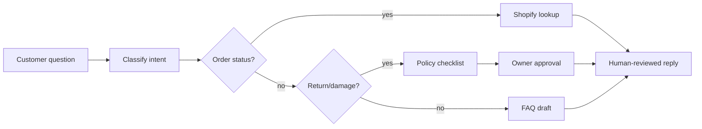

# AI Roadmap Report

## Клиентский пример: e-commerce support, order status и returns

Статус: демонстрационный customer-facing отчет  
Тип: AI implementation roadmap  
Граница: synthetic demo; не customer proof и не коммерческая смета.

---

## 1. Коротко для заказчика

Shopify-магазин получает повторяющиеся вопросы: order status, returns, damaged
items, product details. Support assistant вручную ищет заказ, копирует ответы из
Google Doc, а refund требует owner approval.

Рекомендация: строить **support triage + deterministic order lookup + human
refund gate**, а не autonomous refund bot.

---

## 2. Provenance

| Layer | Что дает |
|---|---|
| Source workflow | Shopify/Gmail/Instagram/Google Docs support workflow |
| Pattern library | customer support triage, ecommerce returns, reporting automation |
| Public n8n signals | Gmail, Shopify-like API flows, Sheets reporting, OpenAI drafts |
| Frontier candidates | damaged-item evidence checklist, owner interruption dashboard |
| Verifier boundary | no automatic refunds, no compensation decisions |

---

## 3. Workflow Map

---

## 4. Recommended Initiatives

| Priority | Initiative | Why | Human Gate | Estimate |
|---:|---|---|---|---:|
| 1 | Order status lookup | factual API lookup; LLM not needed | identity check before details | 1-3 недели / 2,000-10,000 USD |
| 2 | Support triage assistant | reduces repetitive categorization | review first 100 classifications | 3-6 недель / 3,000-15,000 USD |
| 3 | Returns workflow assistant | standardizes policy checks | owner approves refund | 3-6 недель / 4,000-20,000 USD |
| 4 | Weekly support report | owner sees categories and interruptions | owner reviews metrics | 1-2 недели / 1,000-5,000 USD |

MVP scope: order lookup + triage in shadow mode. Returns assistant after policy
review.

---

## 5. Do Not Automate

- automatic refunds;
- compensation decisions;
- final damaged-item resolution;
- public product claims without review;
- exposing order/address details before identity check.

---

## 6. Cost And Team

| Package | Estimate |
|---|---:|
| Quick win | 2-4 недели / 4,000-12,000 USD |
| Support + returns MVP | 6-10 недель / 12,000-40,000 USD |
| Monthly run cost | 200-2,000 USD |

Minimum team:

- owner;
- support assistant;
- AI automation engineer;
- Shopify/integration specialist.

---

## 7. 30/60/90 Plan

- 30 days: clean FAQ, return policy, canned replies, identity rules.
- 60 days: pilot triage and order lookup in shadow mode.
- 90 days: add returns checklist, owner approval queue and weekly support report.

---

## 8. Proof / Boundary

This is a strong SMB workflow because the buyer pain is concrete: repetitive
support and owner interruptions. The roadmap should not claim refund automation
ROI until real ticket volume, labels and refund policy are reviewed.
