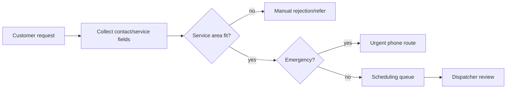

# AI Roadmap Report

## Клиентский пример: HVAC lead intake и service-area qualification

Статус: public-source customer-facing demo  
Тип: AI implementation roadmap  
Граница: public workflow notes; не buyer proof и не commercial pilot evidence.

---

## 1. Коротко для заказчика

HVAC-компания получает заявки через сайт, форму, телефон и online appointment
request. Intake должен быстро понять: service-area fit, urgent/emergency,
residential/commercial, repair/maintenance/install, missing contact details.

Рекомендация: строить **human-reviewed lead intake assistant** с deterministic
field checks и dispatcher approval.

---

## 2. Provenance

| Layer | Что дает |
|---|---|
| Source workflow | public HVAC service intake notes |
| Pattern library | lead qualification, messaging support, appointment booking |
| Public n8n signals | webhook/forms, Slack/Telegram alerts, CRM routing, Sheets |
| Frontier candidates | emergency routing checklist, service-area exception queue |
| Verifier boundary | no diagnosis, no pricing guarantee, no dispatch without human |

---

## 3. Workflow Map

---

## 4. Recommended Initiatives

| Priority | Initiative | Why | Human Gate | Estimate |
|---:|---|---|---|---:|
| 1 | Intake field completeness checker | incomplete forms block scheduling | coordinator approves follow-up | 1-3 недели / 2,000-8,000 USD |
| 2 | Service-area qualification | deterministic ZIP/address check | manual exception review | 2-4 недели / 4,000-12,000 USD |
| 3 | Emergency routing assistant | urgent cases need fast path | no diagnosis, phone escalation | 2-5 недель / 5,000-18,000 USD |
| 4 | CRM/dispatcher handoff | reduces lost leads | dispatcher approves schedule | 3-6 недель / 6,000-22,000 USD |

MVP scope: field completeness + service-area qualification + dispatcher handoff.

---

## 5. Do Not Automate

- HVAC diagnosis from short form text;
- pricing quote without approved estimator;
- arrival-time guarantee;
- technician dispatch without dispatcher approval;
- rejection of edge service-area cases without human review.

---

## 6. Cost And Team

| Package | Estimate |
|---|---:|
| Lead intake MVP | 4-8 недель / 10,000-35,000 USD |
| Monthly run cost | 300-2,000 USD |

Minimum team:

- service manager;
- dispatcher/scheduling coordinator;
- AI automation engineer;
- CRM/service-management integration owner.

---

## 7. 30/60/90 Plan

- 30 days: define required fields, service-area rules, emergency routing rules.
- 60 days: pilot intake assistant in shadow mode on recent requests.
- 90 days: connect CRM handoff and measure response time, missed leads and
  manual corrections.

---

## 8. Proof / Boundary

This is a practical SMB workflow because forms and routing rules are concrete.
Public-source evidence supports workflow mechanics only; real pilot proof needs
actual lead volume, dispatcher edits and conversion measurements.
