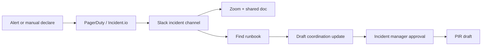

# AI Roadmap Report V2

## Клиентский пример: incident coordination и runbook assistant

Статус: public-source customer-facing demo  
Тип: AI Implementation Decision Pack  
Граница: public incident workflow notes; не production readiness proof и не SRE
compliance certification.

---

## 1. Executive Decision Summary

Incident response проходит через Slack, PagerDuty, Incident.io, Zoom, Google Docs
и service runbooks. Боль не в том, что “AI должен тушить инцидент”, а в
coordination drift: кто on-call, какой severity, где runbook, что писать в
updates, где фиксировать решения.

Рекомендация: строить **incident runbook and coordination assistant** с cited
drafts, role checklist, update drafts and strict human-approved actions.

| Decision Field | Recommendation |
|---|---|
| First use case | runbook retrieval + internal update drafts in shadow mode |
| Не автоматизировать | incident declaration, severity changes, paging, production actions |
| Scenario | Strict internal pilot |
| Pilot-ready срок | 7-10 недель |
| Expected effect | быстрее context gathering, меньше missed roles/artifacts, лучше PIR drafts |
| Proceed decision | proceed after runbook corpus and incident policy approval |

---

## 2. Evidence Boundary

| Evidence Field | Planning Assumption |
|---|---|
| Workflow source | public GitLab-style incident workflow notes |
| Monthly volume | 3-20 incidents/drills/month |
| Systems | Slack, PagerDuty/Incident.io, Zoom, Docs, runbooks |
| Data class | internal/confidential; may include customer-impact details |
| Current pain | coordination drift, outdated runbooks, manual updates/PIRs |
| Missing evidence before quote | approved runbook corpus, incident taxonomy, comms policy, access model |

Public-source notes only prove workflow mechanics. A real pilot needs incident
drill data, runbook quality review and incident manager feedback.

---

## 3. Current-State Workflow



| Step | Actor | System | Pain | Automation Fit |
|---|---|---|---|---|
| Alert/declaration | on-call/IM | PagerDuty/Incident.io | high-impact action | do not automate |
| Role checklist | IM | Slack/doc | easy to miss roles | high deterministic |
| Runbook retrieval | responder | knowledge base | search overhead | high RAG with citations |
| Status update draft | IM/comms | Slack/doc | repeated summarization | medium HITL |
| Severity/customer comms | IM/comms | status page/email | reputational risk | human-only |
| PIR draft | service owner | docs | manual writeup | medium HITL |

---

## 4. Opportunity Provenance

| Layer | Что дает | Boundary |
|---|---|---|
| Pattern library | internal knowledge assistant, incident coordination, reporting automation | known pattern |
| Public n8n signals | Slack/PagerDuty/webhook/OpenAI notification workflows | supporting signal |
| Frontier candidates | update-draft assistant, runbook gap detector | review queue |
| Verifier | blocks paging, severity changes, autonomous incident actions | deterministic gate |

---

## 5. Target Architecture

```text
Incident channel / Incident.io / PagerDuty event
  -> Incident Context Normalizer
  -> Role and Artifact Checklist
  -> Approved Runbook Retriever
  -> Cited Update Draft Worker
  -> Human Approval Queue
  -> Approved Slack/Doc Update
  -> PIR Draft Generator
  -> Evidence Receipt and Decision Log
```

| Component | Needed | Notes |
|---|---|---|
| Incident Context Normalizer | yes | reads incident metadata/channel transcript |
| Runbook Retriever | yes | citation-first, approved corpus only |
| Role Checklist | yes | deterministic checklist by incident type/severity |
| Draft Worker | yes | drafts updates; cannot post without approval |
| Approval Queue | mandatory | IM/comms own updates |
| DB | Postgres | incident metadata, approvals, correction log |
| Object Storage | yes | runbook snapshots, PIR drafts, evidence |
| Monitoring | yes | stale corpus, failed retrieval, unapproved post attempts |

---

## 6. Recommendation Cards

### R1. Runbook Retrieval Assistant

| Field | Value |
|---|---|
| Why | responders need cited context fast |
| Data | approved runbooks, service map, incident metadata |
| Human gate | responder/IM approves action |
| Acceptance | top cited runbook useful in 80% of drill cases |
| Not included | executing production commands |

### R2. Incident Update Draft Assistant

| Field | Value |
|---|---|
| Why | updates must stay synchronized and calm |
| Data | incident timeline, channel facts, approved templates |
| Human gate | IM/comms approves every post |
| Acceptance | 70% drafts accepted after edits |
| Not included | external/customer comms without approval |

### R3. Role and Artifact Checklist

| Field | Value |
|---|---|
| Why | reduces coordination misses |
| Data | incident type, severity, policy checklist |
| Human gate | IM checks completion |
| Acceptance | checklist catches missing owner/doc/channel in drills |

### R4. Post-Incident Summary Draft

| Field | Value |
|---|---|
| Why | reduces PIR writeup time |
| Data | timeline, decisions, updates, owner notes |
| Human gate | service owner approves final PIR |
| Acceptance | draft contains cited timeline and open questions |

---

## 7. Phase-by-Phase Roadmap

| Phase | Duration | Work | Exit Criteria |
|---|---:|---|---|
| 0. Discovery | 1-2 weeks | map incident workflow, roles, runbooks, policies | IM confirms scope |
| 1. Data readiness | 2 weeks | approve runbook corpus, templates, access controls | corpus and retention approved |
| 2. Prototype | 2-3 weeks | runbook retrieval and drafts on historical drills | citation usefulness measured |
| 3. Pilot | 2-3 weeks | shadow mode on drills/low-severity incidents | no unapproved posts/actions |
| 4. Production-lite | 1-2 weeks | monitoring, audit, rollback, runbook freshness checks | IM can operate safely |
| 5. Governance | monthly | review failures, update corpus, tune templates | change log maintained |

---

## 8. Role-Hour Estimate

| Role | Lean | Standard | Strict/Internal |
|---|---:|---:|---:|
| AI solution architect | 18-32h | 40-70h | 80-130h |
| AI/backend engineer | 80-160h | 200-380h | 380-700h |
| Integration engineer | 40-100h | 120-260h | 260-500h |
| SRE/domain reviewer | 40-90h | 100-220h | 220-420h |
| Security/privacy reviewer | 20-60h | 80-160h | 160-320h |
| QA/eval engineer | 30-70h | 100-200h | 200-380h |
| PM/operator | 20-50h | 70-140h | 140-260h |

---

## 9. Cost Estimate: RF and Europe

| Scenario | One-Time Build | Monthly Run | Best For |
|---|---:|---:|---|
| Lean RF | 1.5m-3.5m RUB | 100k-300k RUB | drill-only runbook assistant |
| Standard RF | 4m-9m RUB | 300k-900k RUB | integrated internal pilot |
| Strict RF | 9m-22m+ RUB | 900k-2.5m+ RUB | production-grade sensitive ops |
| Lean Europe | 25k-60k EUR | 900-2.5k EUR | proof-of-value on drills |
| Standard Europe | 70k-170k EUR | 2.5k-9k EUR | integrated Slack/PagerDuty pilot |
| Strict Europe | 170k-400k+ EUR | 9k-30k+ EUR | high-sensitivity internal ops |

Why expensive:

- incident workflows are high-risk;
- security review and audit matter;
- integrations touch operational systems;
- eval must use drills and historical incidents;
- human trust is harder than basic support automation.

---

## 10. LLM/API/Infrastructure

| Component | Lean Setup | Standard/Strict Setup |
|---|---|---|
| Hosting | internal VM/private cloud | private VPC, backups, secrets manager |
| DB | Postgres | Postgres + audit storage |
| RAG | approved runbook corpus | corpus versioning and freshness checks |
| LLM | Sonnet/Opus-class for synthesis | model pinned, change controlled |
| Slack/PagerDuty | read/export first | API integration with strict scopes |
| Monitoring | basic logs | alerts, blocked action attempts, regression evals |

Opus-class model can be justified for complex incident synthesis and architecture
review. Routine retrieval and checklist logic should be deterministic or cheaper
model tiers.

---

## 11. Risk and Do-Not-Automate Register

| Risk | Control |
|---|---|
| autonomous paging | blocked action |
| wrong severity change | human-only severity control |
| stale runbook | corpus version and freshness check |
| public/customer comms error | approval gate and template version |
| production action from AI | AI drafts only; responder executes |

Stop conditions:

- system posts to incident channel without approval;
- assistant triggers paging or changes severity;
- output cites non-approved runbook;
- incident manager says drafts reduce clarity/trust.

---

## 12. Evaluation Plan

Golden set:

- 10 historical incident timelines;
- 5 internal drills;
- 30 runbook retrieval questions;
- 20 status update examples;
- 10 edge cases with ambiguous severity/customer impact.

Acceptance:

- cited runbook usefulness > 80% in drills;
- unapproved operational action = 0;
- status drafts accepted after edits > 70%;
- PIR draft covers timeline/decisions/open questions;
- incident manager trust score measured after every drill.

---

## 13. Governance and Proof Layer

Entropy Core Proof Layer is recommended for this use case.

Proof artifacts:

- runbook source hash and version;
- incident timeline source refs;
- draft approval receipt;
- blocked action register;
- PIR evidence bundle;
- model/prompt/version receipt.

AI Workflow Playbook is valuable because incident assistant requires ongoing
change control: runbooks change, teams change, services change, and evals must
run before model/prompt updates.

---

## 14. Commercial Recommendation

Sell as `AI Roadmap Sprint + Strict Internal Runbook Pilot + Proof Layer`.

Proceed when:

- incident manager owns the rollout;
- runbook corpus can be approved;
- buyer accepts shadow/drill pilot before live incidents.

Postpone when:

- buyer wants autonomous incident response;
- runbooks are not maintained;
- Slack/PagerDuty scopes cannot be constrained.
