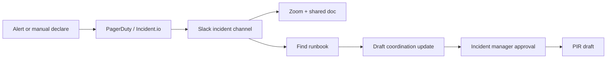

# Клиентский AI Roadmap отчет V2

## Клиентский пример: incident coordination и runbook assistant

Статус: public-source customer-facing demo  
Тип: пакет решений по AI-внедрению  
Граница: public incident workflow notes; не production readiness proof и не SRE
compliance certification.

---

## 1. Краткое решение для заказчика

Incident response проходит через Slack, PagerDuty, Incident.io, Zoom, Google Docs
и service runbooks. Боль не в том, что “AI должен тушить инцидент”, а в
coordination drift: кто on-call, какой severity, где runbook, что писать в
updates, где фиксировать решения.

Рекомендация: строить **incident runbook and coordination assistant** с cited
drafts, role checklist, update drafts and strict human-approved actions.

| Поле | Рекомендация |
|---|---|
| Первый use case | поиск runbook + черновики внутренних updates в shadow mode |
| Не автоматизировать | incident declaration, severity changes, paging, production actions |
| Scenario | Strict internal pilot |
| Pilot-ready срок | 7-10 недель |
| Ожидаемый эффект | быстрее context gathering, меньше missed roles/artifacts, лучше PIR drafts |
| Решение | начинать после утверждения runbook corpus и incident policy |

---

## 2. Граница данных и доказательности

| Поле | Рабочее допущение |
|---|---|
| Workflow source | public GitLab-style incident workflow notes |
| Monthly volume | 3-20 incidents/drills/month |
| Systems | Slack, PagerDuty/Incident.io, Zoom, Docs, runbooks |
| Data class | internal/confidential; may include customer-impact details |
| Current pain | coordination drift, outdated runbooks, manual updates/PIRs |
| Missing evidence before quote | approved runbook corpus, incident taxonomy, comms policy, access model |

Public-source notes only prove workflow mechanics. A real pilot needs incident
drill data, runbook quality review and incident manager feedback.

---

## 3. Текущий процесс



| Шаг | Участник | Система | Боль | Подходит для автоматизации |
|---|---|---|---|---|
| Alert/declaration | on-call/IM | PagerDuty/Incident.io | high-impact action | do not automate |
| Role checklist | IM | Slack/doc | easy to miss roles | high deterministic |
| Runbook retrieval | responder | knowledge base | search overhead | high RAG with citations |
| Status update draft | IM/comms | Slack/doc | repeated summarization | medium HITL |
| Severity/customer comms | IM/comms | status page/email | reputational risk | human-only |
| PIR draft | service owner | docs | manual writeup | medium HITL |

---

## 4. Откуда взялись рекомендации

| Слой | Что дает | Граница |
|---|---|---|
| Pattern library | internal knowledge assistant, incident coordination, reporting automation | known pattern |
| Опция n8n-паттернов | идеи по связкам Slack/PagerDuty/webhook/LLM notification workflows | источник идей, не готовое решение |
| Frontier candidates | update-draft assistant, runbook gap detector | review queue |
| Verifier | blocks paging, severity changes, autonomous incident actions | deterministic gate |

**Отдельная опция для клиента: анализ публичных n8n-паттернов.**  
Для incident workflow эта опция нужна не для автозапуска действий, а чтобы
быстро увидеть типовые безопасные integration patterns: уведомления, draft
updates, webhook ingestion, runbook lookup, handoff в Slack. Все actions остаются
под human approval.

---

## 5. Целевая архитектура

```text
Incident channel / Incident.io / PagerDuty event
  -> Нормализация incident context
  -> Checklist ролей и артефактов
  -> Поиск по утвержденным runbooks
  -> Черновик update с цитатами
  -> Очередь human approval
  -> Slack/Doc update после approval
  -> Черновик PIR
  -> Подтверждение доказательности и журнал решений
```

| Компонент | Нужен | Комментарий |
|---|---|---|
| Incident Context Normalizer | yes | reads incident metadata/channel transcript |
| Runbook Retriever | yes | citation-first, approved corpus only |
| Role Checklist | yes | deterministic checklist by incident type/severity |
| Draft Worker | yes | drafts updates; cannot post without approval |
| Approval Queue | mandatory | IM/comms own updates |
| DB | Postgres | incident metadata, approvals, correction log |
| Object Storage | yes | runbook snapshots, PIR drafts, evidence |
| Monitoring | yes | stale corpus, failed retrieval, unapproved post attempts |

---

## 6. Рекомендации

### R1. Помощник поиска runbook

| Поле | Значение |
|---|---|
| Why | responders need cited context fast |
| Data | approved runbooks, service map, incident metadata |
| Human gate | responder/IM approves action |
| Acceptance | top cited runbook useful in 80% of drill cases |
| Not included | executing production commands |

### R2. Помощник для черновиков incident updates

| Поле | Значение |
|---|---|
| Why | updates must stay synchronized and calm |
| Data | incident timeline, channel facts, approved templates |
| Human gate | IM/comms approves every post |
| Acceptance | 70% drafts accepted after edits |
| Not included | external/customer comms without approval |

### R3. Checklist ролей и артефактов

| Поле | Значение |
|---|---|
| Why | reduces coordination misses |
| Data | incident type, severity, policy checklist |
| Human gate | IM checks completion |
| Acceptance | checklist catches missing owner/doc/channel in drills |

### R4. Черновик post-incident summary

| Поле | Значение |
|---|---|
| Why | reduces PIR writeup time |
| Data | timeline, decisions, updates, owner notes |
| Human gate | service owner approves final PIR |
| Acceptance | draft contains cited timeline and open questions |

---

## 7. План внедрения по этапам

| Этап | Срок | Что делаем | Критерий завершения |
|---|---:|---|---|
| 0. Discovery | 1-2 weeks | map incident workflow, roles, runbooks, policies | IM confirms scope |
| 1. Data readiness | 2 weeks | approve runbook corpus, templates, access controls | corpus and retention approved |
| 2. Prototype | 2-3 weeks | runbook retrieval and drafts on historical drills | citation usefulness measured |
| 3. Pilot | 2-3 weeks | shadow mode on drills/low-severity incidents | no unapproved posts/actions |
| 4. Production-lite | 1-2 weeks | monitoring, audit, rollback, runbook freshness checks | IM can operate safely |
| 5. Governance | monthly | review failures, update corpus, tune templates | change log maintained |

---

## 8. Оценка ролей и часов

| Роль | Lean | Standard | Strict / internal |
|---|---:|---:|---:|
| AI solution architect | 18-32h | 40-70h | 80-130h |
| AI/backend engineer | 80-160h | 200-380h | 380-700h |
| Integration engineer | 40-100h | 120-260h | 260-500h |
| SRE/domain reviewer | 40-90h | 100-220h | 220-420h |
| Security/privacy reviewer | 20-60h | 80-160h | 160-320h |
| QA/eval engineer | 30-70h | 100-200h | 200-380h |
| PM/operator | 20-50h | 70-140h | 140-260h |

---

## 9. Оценка стоимости: РФ и Европа

| Сценарий | Разовая сборка | Ежемесячные расходы | Для чего подходит |
|---|---:|---:|---|
| Lean RF | 1.5m-3.5m RUB | 100k-300k RUB | drill-only runbook assistant |
| Standard RF | 4m-9m RUB | 300k-900k RUB | integrated internal pilot |
| Strict RF | 9m-22m+ RUB | 900k-2.5m+ RUB | production-grade sensitive ops |
| Lean Europe | 25k-60k EUR | 900-2.5k EUR | proof-of-value on drills |
| Standard Europe | 70k-170k EUR | 2.5k-9k EUR | integrated Slack/PagerDuty pilot |
| Strict Europe | 170k-400k+ EUR | 9k-30k+ EUR | high-sensitivity internal ops |

Why expensive:

- incident workflows are high-risk;
- security review and audit matter;
- integrations touch operational systems;
- eval must use drills and historical incidents;
- human trust is harder than basic support automation.

---

## 10. LLM, API и инфраструктура

| Компонент | Lean setup | Standard / strict setup |
|---|---|---|
| Hosting | internal VM/private cloud | private VPC, backups, secrets manager |
| DB | Postgres | Postgres + audit storage |
| RAG | approved runbook corpus | corpus versioning and freshness checks |
| LLM | Sonnet/Opus-class for synthesis | model pinned, change controlled |
| Slack/PagerDuty | read/export first | API integration with strict scopes |
| Monitoring | basic logs | alerts, blocked action attempts, regression evals |

Opus-class model can be justified for complex incident synthesis and architecture
review. Routine retrieval and checklist logic should be deterministic or cheaper
model tiers.

---

## 11. Риски и зоны, которые нельзя автоматизировать

| Риск | Контроль |
|---|---|
| autonomous paging | blocked action |
| wrong severity change | human-only severity control |
| stale runbook | corpus version and freshness check |
| public/customer comms error | approval gate and template version |
| production action from AI | AI drafts only; responder executes |

Stop conditions:

- система публикует сообщение в incident channel без approval;
- помощник запускает paging или меняет severity;
- output ссылается на неутвержденный runbook;
- incident manager говорит, что drafts ухудшают ясность или доверие.

---

## 12. План проверки качества

Тестовый набор:

- 10 исторических incident timelines;
- 5 внутренних drills;
- 30 вопросов на поиск runbook;
- 20 примеров status update;
- 10 edge cases с неоднозначной severity/customer impact.

Критерии приемки:

- полезность найденного runbook выше 80% на drills;
- неутвержденных operational actions = 0;
- status drafts принимаются после правок в 70%+ случаев;
- PIR draft покрывает timeline, decisions и open questions;
- доверие incident manager измеряется после каждого drill.

---

## 13. Контроль и доказательность

Для incident workflow важна не “красивая AI-функция”, а управляемость. Если
помощник предлагает update, runbook или summary, команда должна видеть, на чем
это основано и кто это утвердил.

Что получает заказчик:

- список runbooks, которые разрешено использовать;
- версию runbook, на которую ссылается помощник;
- журнал, кто утвердил черновик update;
- список действий, которые AI не имеет права выполнять;
- evidence bundle для post-incident review;
- журнал изменений prompt/model/runbook.

Опционально можно подключить слой доказательности на базе Entropy Core. Он нужен
не всем, но полезен там, где incident process чувствителен: customer impact,
security, board reporting, SLA или публичные коммуникации.

AI Workflow Playbook здесь полезен как операционная дисциплина: runbooks
меняются, команды меняются, и перед изменением prompt/model нужно прогонять
проверки, а не менять систему “на глаз”.

---

## 14. Коммерческая рекомендация

Рекомендованный оффер: **диагностика incident workflow + внутренний пилот
runbook assistant + опциональный слой доказательности**.

Начинать, если:

- incident manager готов быть владельцем внедрения;
- команда может утвердить список runbooks, которые разрешено использовать;
- заказчик согласен сначала проверить помощника на drills или low-severity
  incidents;
- Slack/PagerDuty доступы можно ограничить безопасными scopes.

Откладывать, если:

- заказчик хочет автономный incident response;
- runbooks не поддерживаются и не имеют владельцев;
- нельзя ограничить доступы к Slack/PagerDuty;
- команда не готова утверждать черновики перед публикацией.
