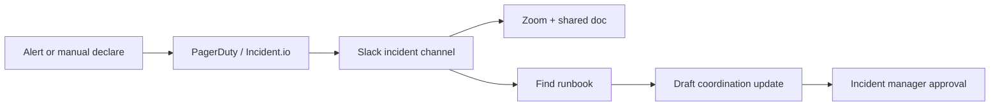

# AI Roadmap Report

## Клиентский пример: incident coordination и runbook assistant

Статус: public-source customer-facing demo  
Тип: AI implementation roadmap  
Граница: public incident workflow notes; не production readiness proof.

---

## 1. Коротко для заказчика

Incident response проходит через Slack, PagerDuty, Incident.io, Zoom, Google Docs
и service runbooks. Боль не в том, что “AI должен тушить инцидент”, а в
coordination drift: кто on-call, какой severity, где runbook, что писать в
updates, где фиксировать решения.

Рекомендация: строить **incident runbook and coordination assistant** с cited
drafts и human-approved actions.

---

## 2. Provenance

| Layer | Что дает |
|---|---|
| Source workflow | public GitLab incident workflow notes |
| Pattern library | internal knowledge assistant, incident coordination |
| Public n8n signals | Slack/PagerDuty/webhook/OpenAI notification workflows |
| Frontier candidates | update-draft assistant, runbook gap detector |
| Verifier boundary | no autonomous incident declaration or paging |

---

## 3. Workflow Map

---

## 4. Recommended Initiatives

| Priority | Initiative | Why | Human Gate | Estimate |
|---:|---|---|---|---:|
| 1 | Runbook retrieval assistant | responders need cited runbook context | incident manager approves action | 3-6 недель / 8,000-25,000 USD |
| 2 | Incident update draft assistant | updates must stay synchronized | comms/IM approves post | 2-5 недель / 5,000-18,000 USD |
| 3 | Role and artifact checklist | reduces coordination misses | IM checks before severity changes | 1-3 недели / 3,000-10,000 USD |
| 4 | Post-incident summary draft | reduces manual writeup time | owner approves final PIR | 2-4 недель / 4,000-14,000 USD |

MVP scope: runbook retrieval + update drafts in shadow mode.

---

## 5. Do Not Automate

- incident declaration;
- severity changes;
- PagerDuty paging;
- customer/public comms without approval;
- service actions from runbook without responder confirmation.

---

## 6. Cost And Team

| Package | Estimate |
|---|---:|
| Coordination MVP | 5-9 недель / 15,000-45,000 USD |
| Monthly run cost | 500-4,000 USD |

Minimum team:

- incident manager;
- SRE/service owner;
- AI automation engineer;
- security/privacy reviewer.

---

## 7. 30/60/90 Plan

- 30 days: define approved runbook corpus, roles, incident update templates.
- 60 days: shadow-mode runbook assistant and update drafts for internal drills.
- 90 days: pilot on low-severity incidents with strict human approval and
  rollback criteria.

---

## 8. Proof / Boundary

This is not an autonomous incident agent. The roadmap creates better context and
coordination drafts while keeping production actions with humans. Real proof
requires incident manager feedback, drill results and post-incident metrics.
