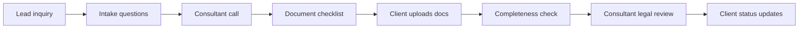

# AI Roadmap Report

## Клиентский пример: legal / immigration intake

Статус: демонстрационный customer-facing отчет  
Тип: AI implementation roadmap  
Граница: synthetic demo; не legal advice, не customer proof и не compliance
certification.

---

## 1. Коротко для заказчика

Immigration consultancy тратит много времени на intake, missing documents и
status questions. При этом данные restricted: passport, legal status, family
details, employment history.

Рекомендация: строить **private checklist assistant**, а не cloud legal advisor.

---

## 2. Provenance

| Layer | Что дает |
|---|---|
| Source workflow | legal intake, shared drive, checklist, case tracker |
| Pattern library | legal checklist assistant, document extraction, internal knowledge |
| Public n8n signals | document processing, Drive/Notion/Sheets workflows, AI summaries |
| Frontier candidates | missing-document prioritization, client status FAQ, internal case brief |
| Verifier boundary | no legal eligibility decision, no final advice |

---

## 3. Workflow Map

---

## 4. Recommended Initiatives

| Priority | Initiative | Why | Human Gate | Estimate |
|---:|---|---|---|---:|
| 1 | Private checklist assistant | reduces missing-document back-and-forth | consultant owns checklist logic | 3-6 недель / 6,000-25,000 USD |
| 2 | Missing-document tracker | deterministic status and reminders | coordinator approves client message | 2-4 недели / 3,000-12,000 USD |
| 3 | Internal case brief | prepares consultant before call/review | consultant reviews before use | 2-5 недель / 5,000-18,000 USD |
| 4 | Client status FAQ | reduces repeated status questions | no legal interpretation | 2-4 недели / 3,000-10,000 USD |

MVP scope: missing-document tracker + private checklist assistant.

---

## 5. Do Not Automate

- legal eligibility decisions;
- legal strategy;
- final advice;
- document submission to authorities;
- client-facing legal interpretation without consultant review;
- unrestricted cloud processing of raw identity documents.

---

## 6. Cost And Team

| Package | Estimate |
|---|---:|
| Restricted-data MVP | 5-9 недель / 12,000-40,000 USD |
| Monthly run cost | 300-2,500 USD |
| Privacy overhead | higher due to private/local handling |

Minimum team:

- consultant;
- coordinator;
- AI automation engineer;
- privacy/data reviewer.

---

## 7. 30/60/90 Plan

- 30 days: define checklist taxonomy, data retention, private mode and source
  access.
- 60 days: pilot missing-document tracker on reviewed cases.
- 90 days: add internal case briefs and client status FAQ with consultant
  review.

---

## 8. Proof / Boundary

This report is valuable because it shows restraint: the best AI roadmap is not
always “more automation”. For restricted workflows, the buyer value is safer
admin acceleration, not autonomous legal judgment.
