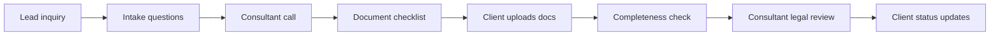

# AI Roadmap Report V2

## Клиентский пример: legal / immigration intake

Статус: демонстрационный customer-facing отчет  
Тип: AI Implementation Decision Pack  
Граница: synthetic demo; не legal advice, не compliance certification, не fixed
quote.

---

## 1. Executive Decision Summary

Immigration consultancy тратит много времени на intake, missing documents и
status questions. При этом данные restricted: passport, legal status, family
details, employment history.

Рекомендация: строить **private checklist and case-prep assistant**, а не cloud
legal advisor и не autonomous eligibility engine.

| Decision Field | Recommendation |
|---|---|
| First use case | missing-document tracker + private checklist assistant |
| Не автоматизировать | legal eligibility, legal strategy, final advice, authority submissions |
| Scenario | Strict/private pilot |
| Pilot-ready срок | 7-10 недель |
| Expected effect | меньше back-and-forth, лучше подготовка консультанта, меньше forgotten documents |
| Proceed decision | proceed only after data retention and private mode are approved |

---

## 2. Evidence Boundary

| Evidence Field | Planning Assumption |
|---|---|
| Workflow source | synthetic immigration/legal intake workflow |
| Monthly volume | 50-200 active cases/month |
| Systems | intake form, shared drive, checklist, case tracker, email |
| Data class | restricted identity/legal/family/employment data |
| Current pain | incomplete docs, repeated status questions, manual case prep |
| Missing evidence before quote | checklist taxonomy, document types, retention policy, access model |

This report is intentionally more conservative than SMB booking/support reports:
privacy and liability drive architecture and cost.

---

## 3. Current-State Workflow



| Step | Actor | System | Pain | Automation Fit |
|---|---|---|---|---|
| Intake questions | coordinator | form/email | repeated data collection | medium |
| Checklist generation | consultant | templates | manual selection | medium HITL |
| Document upload | client/coordinator | drive/portal | missing files | high deterministic |
| Completeness check | coordinator | checklist/drive | tedious verification | high private assistant |
| Legal review | consultant | case file | professional judgment | do not automate |
| Status questions | client/coordinator | email/chat | repeated updates | medium with strict boundaries |

---

## 4. Opportunity Provenance

| Layer | Что дает | Boundary |
|---|---|---|
| Pattern library | legal checklist assistant, document extraction, internal knowledge | known pattern |
| Public n8n signals | Drive/Notion/Sheets workflows, document processing, AI summaries | supporting signal |
| Frontier candidates | missing-doc prioritization, internal case brief, status FAQ | human review required |
| Verifier | blocks legal advice, eligibility decisions and unrestricted cloud | deterministic gate |

---

## 5. Target Architecture

```text
Client intake / upload portal
  -> Permission and Data Classification Gate
  -> Private Document Metadata Extractor
  -> Checklist Rules Engine
  -> Missing Document Tracker
  -> Internal Case Brief Draft Worker
  -> Consultant Review Queue
  -> Approved Client Status Draft
  -> Evidence Receipt and Audit Log
```

| Component | Needed | Notes |
|---|---|---|
| Private intake store | yes | raw identity docs should not go to unrestricted cloud |
| Checklist Rules Engine | yes | deterministic jurisdiction/case-type mapping where possible |
| Document Metadata Extractor | yes | extracts type/status, not legal conclusion |
| Internal Brief Worker | optional | drafts summary for consultant only |
| Client Status Draft | optional | no legal interpretation |
| Review Queue | mandatory | consultant owns legal meaning |
| DB | private Postgres | cases, checklist status, approvals |
| Object Storage | encrypted/private | documents, receipts, retention controls |

---

## 6. Recommendation Cards

### R1. Missing-Document Tracker

| Field | Value |
|---|---|
| Why | high-volume admin pain with low legal judgment |
| Data | checklist, uploaded files, due dates |
| Human gate | coordinator approves client reminders |
| Acceptance | 90% checklist statuses correct on sample cases |
| Not included | legal interpretation of documents |

### R2. Private Checklist Assistant

| Field | Value |
|---|---|
| Why | reduces repeated checklist assembly |
| Data | case type, jurisdiction, approved template library |
| Human gate | consultant approves checklist before client use |
| Acceptance | consultant accepts 70%+ checklist drafts after edits |
| Not included | eligibility decision or legal strategy |

### R3. Internal Case Brief

| Field | Value |
|---|---|
| Why | consultant prepares faster before call/review |
| Data | intake answers, uploaded document status, notes |
| Human gate | consultant reviews before relying on it |
| Acceptance | brief cites source fields and flags missing evidence |
| Not included | final advice to client |

### R4. Client Status FAQ Drafts

| Field | Value |
|---|---|
| Why | reduces repeated “what is happening?” questions |
| Data | case status, checklist status, approved generic FAQ |
| Human gate | coordinator/consultant approves messages |
| Acceptance | no legal interpretation in drafts |

---

## 7. Phase-by-Phase Roadmap

| Phase | Duration | Work | Exit Criteria |
|---|---:|---|---|
| 0. Discovery | 1-2 weeks | map case types, documents, data retention, roles | consultant confirms boundaries |
| 1. Data readiness | 2 weeks | checklist taxonomy, private storage, access controls | privacy mode approved |
| 2. Prototype | 2-3 weeks | missing-doc tracker on historical cases | statuses match human review |
| 3. Pilot | 2-3 weeks | coordinator review queue and approved reminders | no raw restricted data leaves boundary |
| 4. Production-lite | 1-2 weeks | backups, audit log, runbook, retention controls | owner can operate safely |
| 5. Governance | monthly | review corrections, template changes, audit receipts | consultant signs off changes |

---

## 8. Role-Hour Estimate

| Role | Lean | Standard | Strict/Private |
|---|---:|---:|---:|
| AI solution architect | 16-28h | 32-56h | 60-100h |
| AI automation engineer | 80-150h | 180-320h | 320-560h |
| Integration/backend engineer | 40-90h | 100-220h | 220-420h |
| Data/privacy reviewer | 20-50h | 60-120h | 120-240h |
| QA/eval engineer | 20-40h | 60-120h | 120-220h |
| Consultant/domain reviewer | 30-70h | 80-160h | 160-300h |
| PM/operator | 20-40h | 50-100h | 100-180h |

---

## 9. Cost Estimate: RF and Europe

| Scenario | One-Time Build | Monthly Run | Best For |
|---|---:|---:|---|
| Lean RF | 1.2m-2.8m RUB | 80k-220k RUB | checklist tracker with private handling |
| Standard RF | 3m-7m RUB | 220k-650k RUB | private pilot with upload/status workflow |
| Strict RF | 7m-15m+ RUB | 650k-1.8m+ RUB | audit-heavy restricted workflow |
| Lean Europe | 20k-45k EUR | 700-2k EUR | limited private pilot |
| Standard Europe | 55k-130k EUR | 2k-7k EUR | integrated case workflow |
| Strict Europe | 130k-300k+ EUR | 7k-20k+ EUR | regulated/private deployment |

Why higher than salon/support:

- restricted data;
- private storage and retention controls;
- higher domain review time;
- legal boundary review;
- audit/proof expectations.

---

## 10. LLM/API/Infrastructure

| Component | Recommended Mode | Notes |
|---|---|---|
| Hosting | private cloud or client-approved environment | public cloud only after legal/privacy review |
| Storage | encrypted object storage | raw docs require retention controls |
| DB | private Postgres | case metadata, checklist status, approvals |
| LLM | private-approved provider or local/private path | no unrestricted cloud for raw docs |
| RAG | optional | only over approved templates and generic FAQ |
| Audit | required | source refs, reviewer approvals, template versions |

LLM usage should be minimized for raw documents. Use deterministic metadata
checks first, and use LLM for internal summaries only after redaction/private
mode approval.

---

## 11. Risk and Do-Not-Automate Register

| Risk | Control |
|---|---|
| AI gives legal advice | blocked category + consultant review |
| unrestricted cloud exposure | private/local mode for restricted docs |
| wrong checklist | consultant approves before client use |
| stale template | template version in every output |
| authority submission error | submissions remain human-only |

Stop conditions:

- raw passport/legal data sent to unapproved cloud;
- assistant states eligibility or strategy as final advice;
- client-facing message contains legal interpretation without consultant review;
- retention/audit log fails.

---

## 12. Evaluation Plan

Golden set:

- 30 historical cases with checklist status;
- 20 missing-document examples;
- 10 status questions;
- 10 edge cases with ambiguous documents.

Acceptance:

- document status accuracy > 90%;
- consultant accepts checklist drafts > 70% after edits;
- legal advice in AI output = 0;
- raw restricted data boundary violations = 0;
- coordinator saves measurable follow-up time in pilot.

---

## 13. Governance and Proof Layer

Entropy Core Proof Layer is recommended here, not optional polish.

Proof artifacts:

- source hash for each checklist recommendation;
- assumption registry for uncertain document status;
- consultant approval receipt;
- blocked-surface list: eligibility, strategy, submission, final advice;
- audit bundle for template/model/version changes.

AI Workflow Playbook is valuable if the firm wants to build a repeatable internal
AI delivery process for multiple legal/admin workflows.

---

## 14. Commercial Recommendation

Sell as `AI Roadmap Sprint + Strict Private Intake Pilot + Proof Layer`.

Proceed when:

- consultancy has enough case volume;
- consultant is willing to define checklist boundaries;
- buyer understands this is admin acceleration, not legal automation.

Postpone when:

- firm wants autonomous legal advice;
- data governance is undefined;
- there is no owner for template/version approval.
