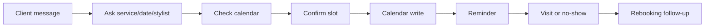

# AI Roadmap Report V2

## Клиентский пример: салон красоты, запись и reminders

Статус: демонстрационный customer-facing отчет  
Тип: AI Implementation Decision Pack  
Граница: synthetic demo; не customer proof и не fixed quote. Расчет ниже -
planning estimate для разговора с buyer/cofounder.

---

## 1. Executive Decision Summary

Салон получает записи через Instagram, WhatsApp, телефон и Google Calendar.
Администратор вручную отвечает на повторяющиеся вопросы, проверяет календарь,
создает запись и отправляет reminders.

Рекомендация: начать не с автономного AI-бота, а с **booking operations layer**:
детерминированные проверки календаря, reminders, weekly analytics и AI только
для черновиков ответов.

| Decision Field | Recommendation |
|---|---|
| First use case | reminders + booking analytics + shadow-mode reply drafts |
| Не автоматизировать | штрафы, медицинские советы, спорные жалобы, opt-out клиентов |
| Scenario | Lean RF/EU pilot |
| Pilot-ready срок | 3-5 недель |
| Expected effect | меньше no-shows, меньше пропущенных сообщений, меньше ручного follow-up |
| Proceed decision | proceed with lean pilot after calendar/message access check |

---

## 2. Evidence Boundary

| Evidence Field | Planning Assumption |
|---|---|
| Workflow source | synthetic salon workflow |
| Weekly volume | 70-100 appointments/week |
| Channels | Instagram, WhatsApp, phone, Google Calendar |
| Current pain | missed messages, manual reminders, no channel analytics |
| Data class | contact details = sensitive; service/date preferences = internal |
| Missing evidence before quote | real message samples, no-show rate, calendar rules, opt-out policy |

Если реальный салон не даст 2-4 недели сообщений, календарных событий и no-show
статистики, стоимость остается broad planning range.

---

## 3. Current-State Workflow



| Step | Actor | System | Pain | Automation Fit |
|---|---|---|---|---|
| Intake message | receptionist | WhatsApp/Instagram | repeated questions | high |
| Service/date уточнение | receptionist | messenger | slow back-and-forth | medium |
| Calendar check | receptionist | Google Calendar | double-booking risk | high deterministic |
| Reminder | receptionist | messenger | forgotten manual work | high deterministic |
| Rebooking | owner/stylist | messenger | inconsistent follow-up | medium |
| Complaint/medical advice | owner/stylist | messenger | high judgment | do not automate |

---

## 4. Opportunity Provenance

| Layer | Что дает | Boundary |
|---|---|---|
| Pattern library | appointment booking, reminders, reporting automation | known SMB pattern |
| Public n8n signals | calendar, WhatsApp/Gmail, Sheets/reporting, reminders | supporting signal only |
| Frontier candidates | rebooking queue, source analytics, cancellation-risk list | review queue only |
| Verifier | blocks medical advice, penalties and unapproved live writes | deterministic boundary |

---

## 5. Target Architecture

```text
Messaging intake export/webhook
  -> Intake Normalizer
  -> Contact and Consent Filter
  -> Calendar Availability Checker
  -> Reminder Scheduler
  -> AI Reply Draft Worker
  -> Human Approval Queue
  -> Calendar Write / Message Send after approval
  -> Weekly Analytics Report
  -> Evidence Log
```

| Component | Needed | Notes |
|---|---|---|
| Intake Parser | yes | normalizes messages into service/date/stylist/contact fields |
| Calendar API | yes | Google Calendar read; write only after approval |
| Reminder Scheduler | yes | deterministic timing rules |
| AI Draft Worker | optional | drafts polite replies; does not decide availability |
| Review Queue | yes | receptionist approves first live messages |
| DB | SQLite for demo, Postgres for pilot | stores bookings, consent, logs, corrections |
| Monitoring | lightweight | missed reminders, failed sends, double-booking alerts |

---

## 6. Recommendation Cards

### R1. Reminder Automation

Build deterministic reminders 24h/3h before appointment with opt-out handling.

| Field | Value |
|---|---|
| Why | immediate value without AI risk |
| Data | calendar event, phone/messenger id, opt-out status |
| Human gate | owner approves templates and timing |
| Acceptance | 95% reminders sent; zero opt-out violations |
| Not included | penalty decisions or cancellation disputes |

### R2. Booking Slot Assistant

Assistant suggests available slots and drafts replies. Calendar write stays
human-approved until conflict checks are proven.

| Field | Value |
|---|---|
| Why | reduces back-and-forth and missed leads |
| Data | service menu, duration rules, calendar, message thread |
| Human gate | receptionist approves final booking |
| Acceptance | 80% common requests get correct slot suggestions |
| Not included | fully autonomous booking for edge cases |

### R3. Weekly Booking Analytics

Weekly report by channel, no-shows, cancellations, service type and rebooking
opportunities.

| Field | Value |
|---|---|
| Why | owner currently lacks channel visibility |
| Data | booking records, source channel, status |
| Human gate | owner reviews report before changing policy |
| Acceptance | report reconciles with calendar within 5% |

---

## 7. Phase-by-Phase Roadmap

| Phase | Duration | Work | Exit Criteria |
|---|---:|---|---|
| 0. Discovery | 3-5 days | collect messages, calendar rules, service menu, no-show baseline | owner confirms workflow and metric |
| 1. Data readiness | 3-5 days | define booking fields, opt-out rules, calendar access, templates | fields and privacy mode approved |
| 2. Prototype | 1-2 weeks | reminders + analytics from exported data; draft replies in shadow mode | no live sends; owner validates examples |
| 3. Pilot | 2 weeks | enable approved reminders and receptionist review queue | no missed opt-outs; correction rate tracked |
| 4. Production-lite | 1 week | monitoring, backup, runbook, handoff | receptionist can operate without developer |
| 5. Improvement loop | monthly | tune templates, add rebooking experiments | no-show and manual time measured |

---

## 8. Role-Hour Estimate

| Role | Lean | Standard | Strict/Private |
|---|---:|---:|---:|
| AI solution architect | 8-14h | 16-24h | 24-40h |
| AI automation engineer | 32-60h | 80-140h | 140-220h |
| Integration engineer | 12-30h | 40-80h | 80-140h |
| QA/eval engineer | 8-16h | 20-40h | 40-70h |
| Owner/receptionist reviewer | 8-16h | 20-40h | 40-60h |
| PM/operator | 6-12h | 16-28h | 28-44h |

---

## 9. Cost Estimate: RF and Europe

Расчет использует v2 rate-card logic из
`docs/demo/CLIENT_REPORT_V2_UPGRADE_STRATEGY_RU.md`.

| Scenario | One-Time Build | Monthly Run | Best For |
|---|---:|---:|---|
| Lean RF | 250k-650k RUB | 10k-45k RUB | reminders + analytics + shadow drafts |
| Standard RF | 700k-1.7m RUB | 40k-120k RUB | approved messaging + calendar integration |
| Lean Europe | 4k-10k EUR | 80-350 EUR | one-location pilot |
| Standard Europe | 12k-28k EUR | 300-900 EUR | multi-channel workflow |

Cost drivers:

- official WhatsApp/Instagram API access versus manual/export mode;
- number of stylists and service duration rules;
- whether calendar writes are enabled;
- how much message history is processed;
- whether the salon needs Russian or EU data residency.

---

## 10. LLM/API/Infrastructure

| Component | Lean Setup | Notes |
|---|---|---|
| Hosting | small VM or local server | 5-30 EUR/month in EU-style setup; RF via provider calculator |
| DB | SQLite/Postgres | Postgres once multiple users or audit log needed |
| LLM | small/Sonnet-class for draft replies | Opus-class unnecessary for routine booking |
| Messaging API | provider-specific | often bigger constraint than LLM cost |
| Calendar API | Google/Microsoft | write permissions delayed until pilot |

LLM cost should be calculated as:

```text
monthly_messages * avg_tokens_per_reply * model_price
```

For this use case, LLM cost is usually not the main cost. Integration access and
operator rollout are.

---

## 11. Risk and Do-Not-Automate Register

| Risk | Control |
|---|---|
| double booking | deterministic availability check + human approval |
| opt-out violation | consent filter before every send |
| medical/cosmetology advice | blocked content category |
| wrong cancellation penalty | do not automate penalties |
| hallucinated availability | LLM never owns calendar truth |

Stop conditions:

- reminder sent to opted-out customer;
- calendar write happened without approval during pilot;
- assistant gives medical advice;
- double-booking caused by automation.

---

## 12. Evaluation Plan

Golden set:

- 50 historical booking messages;
- 20 cancellation/reschedule cases;
- 10 opt-out and edge cases;
- 4 stylist/service duration conflict cases.

Acceptance:

- reminder delivery success > 95%;
- opt-out violation = 0;
- slot suggestion correctness > 80% on common cases;
- owner reports at least 3-5 hours/week manual reduction before expansion.

---

## 13. Governance and Proof Layer

Base pilot can run without Entropy Core. Add Entropy Core Proof Layer if the
salon group has multiple locations, franchise reporting, sensitive client
complaints or owner wants audit receipts.

Proof artifacts:

- template approval receipt;
- calendar write approval log;
- reminder send log;
- correction history;
- no-show metric baseline and monthly comparison.

AI Workflow Playbook is optional here. It becomes useful if this is the first of
many automation workflows across a salon chain.

---

## 14. Commercial Recommendation

Sell as `AI Roadmap Sprint + Lean Booking Pilot`.

Best first offer:

- 1 week paid diagnostic;
- 3-5 week pilot;
- no autonomous bot promise;
- success measured by no-show rate, missed messages and receptionist time.

Proceed if the buyer has at least 70 appointments/week or multiple channels.
Postpone if volume is low and manual reminders are already reliable.
