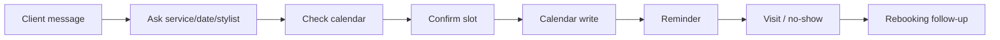

# AI Roadmap Report

## Клиентский пример: салон красоты, запись и reminders

Статус: демонстрационный customer-facing отчет  
Тип: AI implementation roadmap  
Граница: synthetic demo; не customer proof и не коммерческая смета.

---

## 1. Коротко для заказчика

Салон получает записи через Instagram, WhatsApp, телефон и Google Calendar.
Администратор вручную отвечает на повторяющиеся вопросы, проверяет календарь,
создает запись и отправляет reminders.

Рекомендация: начать не с AI-бота, а с **deterministic booking operations layer**
с легким AI только для draft replies.

Ожидаемый эффект MVP: меньше пропущенных сообщений, меньше no-shows, меньше
ручной работы администратора, без автоматических штрафов и спорных решений.

---

## 2. Provenance

| Layer | Что дает |
|---|---|
| Source workflow | synthetic salon workflow: 70-100 appointments/week |
| Pattern library | appointment booking, reporting automation, messaging support |
| Public n8n signals | calendar, WhatsApp/Gmail, Sheets/reporting, reminders |
| Frontier candidates | source analytics, rebooking follow-up, cancellation-risk queue |
| Verifier boundary | no medical advice, no penalty decision, no final write without check |

---

## 3. Workflow Map

Главная боль: workflow простой, но объемный. AI нужен не везде: reminders,
availability check и reporting лучше делать deterministic.

---

## 4. Recommended Initiatives

| Priority | Initiative | Why | Human Gate | Estimate |
|---:|---|---|---|---:|
| 1 | Appointment reminders | clear trigger, no AI needed | owner approves template | 3-7 дней / 500-3,000 USD |
| 2 | Booking slot assistant | drafts replies and suggests slots | final calendar write checked | 2-5 недель / 3,000-15,000 USD |
| 3 | Booking analytics report | owner lacks channel visibility | owner reviews weekly report | 1-2 недели / 1,000-5,000 USD |
| 4 | Rebooking follow-up drafts | repeated post-visit workflow | stylist/owner approves message | 1-3 недели / 1,000-6,000 USD |

MVP scope: reminders + booking analytics + assistant in shadow mode.

---

## 5. Do Not Automate

- cancellation penalty decisions;
- medical or skin-condition advice;
- customer complaint resolution;
- final calendar writes without deterministic availability check;
- messaging customers who opted out.

---

## 6. Cost And Team

| Package | Estimate |
|---|---:|
| Quick win | 1-2 недели / 1,500-6,000 USD |
| Booking MVP | 3-6 недель / 5,000-18,000 USD |
| Monthly run cost | 50-700 USD |

Minimum team:

- owner;
- receptionist;
- AI automation engineer;
- optional messaging/calendar integration specialist.

---

## 7. 30/60/90 Plan

- 30 days: clean service menu, booking fields, reminder templates, opt-out text.
- 60 days: pilot slot assistant in shadow mode on WhatsApp/Instagram examples.
- 90 days: add analytics and rebooking follow-up experiments.

---

## 8. Proof / Boundary

This workflow is a strong first showcase because much of the value comes from
classic automation, not overbuilt AI. The report proves prioritization logic,
privacy boundaries and cost reasoning. It does not prove salon buyer demand
until a real salon pilot measures no-shows and admin time.
